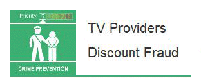

2 May 2018

Fraud Alert from Neighbourhood Alert

Thanks to Neighbourhood Alert for sending the following message warning:

The National Fraud Intelligence Bureau (NFIB) have noticed an increase in Action Fraud reports where fraudsters are offering a discount on Television service provider subscriptions.

Click on the poster

to read the full alert.

Fraudsters are cold-calling victims, purporting to be from a Television (TV) provider offering a discount on their monthly subscription. Victims have been told the following: their subscription needs to be renewed; that part or all, of the TV equipment has expired and they are due an upgrade on the equipment/subscription. In order to falsely process the discount, the fraudster asks victims to confirm or provide their bank account details. The scammers may also request the victim's identification documents, such as scanned copies of passports.
