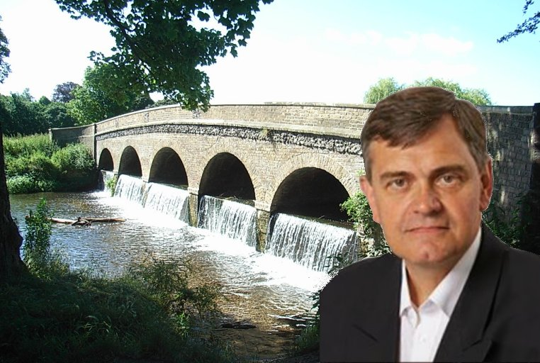

4 May 2018

Councillor Donald Massey

Yesterday's Local Government Elections marks a significant change to our community structure. North Cray is now part of the new St Marys and St James Ward, with two councillors instead of the three formerly allocated to the old Cray Meadows Ward.

Sadly, Councillor Don Massey, who has been a stalwart supporter of the North Cray Residents Association had made the decision not to stand in yesterday's election and has now stepped down from his role as councillor.

Don has been an ex officio member of the NCRA Committee and has attended our committee meetings and our Annual General Meeting where he has given invaluable advice and guidance.

At Bexley's planning committee meetings, and at Appeal Hearings before the Planning Inspectorate, Don's presence has been an enormous support to the NCRA, especially by speaking on our behalf whenever it was appropriate.

Many of us will additionally have had the benefit of Don's advice, support and intervention in resolving issues in our personal dealings with Bexley Council. His experience and contacts has frequently enabled him to cut through red tape and bring our issues quickly to the most relevant council officer.

I am sure that you will all join me in giving our heartfelt thanks to Don and wish him all the very best for the future.
