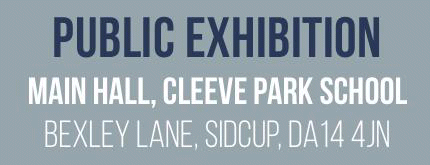

4 May 2018

Cleeve Meadow School: Public Exhibition Invite

Thanks to Sophie Ingham Clark for sending the following message :

We would like to invite you to a public exhibition to view the development proposals for a new Free School within the site of Cleeve Park School.

Click on the poster

for more details.

The building proposals are for a new 120 place Free School for students with moderate learning difficulties and autism. The new school will be constructed within the site of the existing Cleeve Park School. The school will be managed by The Kemnal Academies Trust, who currently run the existing Cleeve Park School.

The public exhibition will be held in the Main Hall of Cleeve Park School, Bexley Lane, Sidcup, DA14 4JN on Saturday 12 May between 10:30am and 1:00pm and on Monday 14 May between 4:30pm and 7:30pm. This will be a great opportunity to view the details of the plans and leave your feedback. Members of the project team will be in attendance to answer any questions you may have.

Please find attached a copy of the invitation sent to local residents. (see poster above)

We look forward to meeting you there.

Kind regards,

Sophie Ingham Clark
