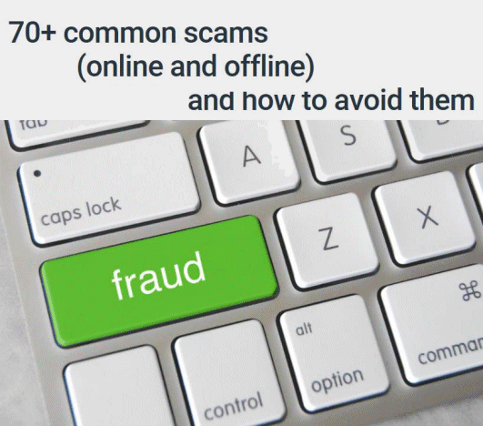

17 May 2018

(1) Comprehensive Scam Advice

Thanks to Sophie Hunt from Comparitech for sending us a link to what I believe is the most comprehensive list of Scam Avoidance Advice currently available.

To read the advice, simply click on the poster (left).

---

(2) The Footscray Meadows Cygnets - Final Update

NCRA has received several emails from our members. A few of these are printed below - they make very sad reading :

(a) On 15th May from SG :

Went to look at swans with granddaughter Friday I think it was 2 swans with 1 cygnet came over to see us. Did not see anyone suspicious. Thought it was odd a the time only 1 cygnet, but did not think more of it as had to get granddaughter home. Hope this info helps.

(b) On 15th May from C :

Hi I only saw 1 cygnet on Saturday and today none. So sad. Both parents were by the bridge.

(c) On 15th May from FM :

I have been told that the last cygnet went over the weir this morning. Someone pulled it out but it was dead. 2 were dead in the nest. No idea about the rest
