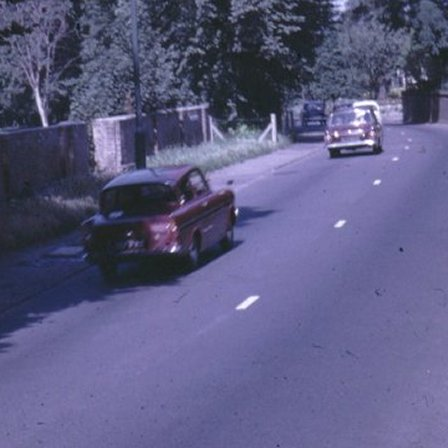
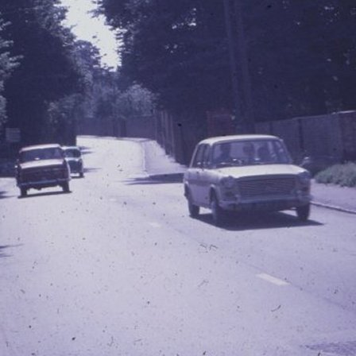
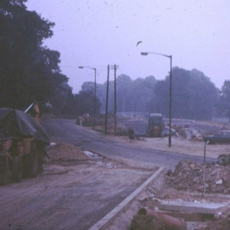
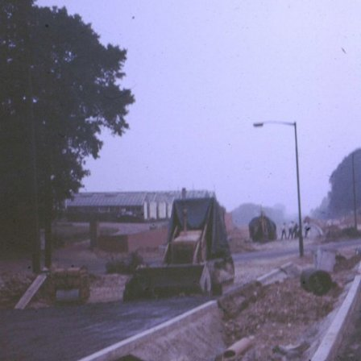

27 May 2018

Local History - The North Cray Road

Thanks to Malcolm Barr Hamilton for the following item about the old North Cray road:

Of great concern to local residents 53 years ago was the uncertainty of whether or not anything would ever be done to improve the North Cray Road - a centuries old country road then full of danger for pedestrians because of its winding character and narrowness, in one place it was only 15 feet wide.

Click on the image

for an enlarged view.

Click on the image

for an enlarged view.

By 1965 people had been waiting 26 years for something to be done about widening it and since 1961 there had been four deaths. All this had been made even worse by the opening of the Dartford-Purfleet tunnel, after which even more heavy traffic was racing along our road and through our Village on journeys between the A2 and the A20.

Click on the image

for an enlarged view.

Click on the image

for an enlarged view.

In February 1965 our then MP, Dame Patricia Hornsby-Smith, raised the matter in Parliament and by 1970 the long-awaited new North Cray Road had at last come into being! But with the loss of much of our ancient Village, and with the new dual carriageway dividing our community into two.

What Dame Patricia Hornsby-Smith reported to Parliament, and its response, can be read by following this[Link](https://api.parliament.uk/historic-hansard/commons/1965/feb/17/north-cray-road-sidcup).
