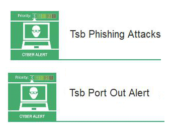

27 May 2018

Two TSB Fraud Alert

Thanks to Neighbourhood Alert for sending the following two Fraud Alerts :

Click on the poster to

read the full alert.

There has been a sharp rise in fraudsters sending out fake text messages (smishing) and phishing emails claiming to be from TSB. The increase in the number of reports corresponds with the timing of TSB's computer system update, which resulted in 1.9 million users being locked out of their accounts. Opportunistic fraudsters are using TSB's system issue to target people with this type of fraud.

AND

There has been an increase in reports made in May by TSB customers relating to "port-out" fraud. Fraudsters are number porting a victim's telephone number to a SIM card under their control and then using the number to access the victim's bank accounts.
