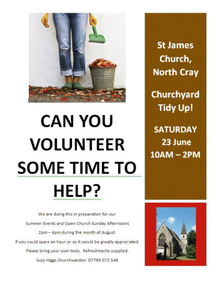

4 June 2018

A Hundred and One Things To Do ?

Do you feel that you always have 'A Hundred and One Things To Do?' - I know that I often do, but then when I am on top of things it is always good to have something in mind that I enjoy doing.

In case you need some suggestions for things to do and places to visit during the summer months, here are 'A Hundred and One Things To Do'

Click on the poster

for more details.

First and foremost, thanks to Suzy Higgs for an invitation to take part in a 'Church Yard Tidy Up' on Saturday 23 June between 10am and 2pm. This is in preparation for the forthcoming program of Summer Events and also the Open Church Afternoons every Sunday thoughout the month of August.

For the other 100 things to do we have to thank Jane Rogers from 'Your RV Lifestyle' for sending us the following [LINK](https://www.your-rv-lifestyle.com/things-to-do-in-england.html) to their list of '100 Things To Do In England'.
