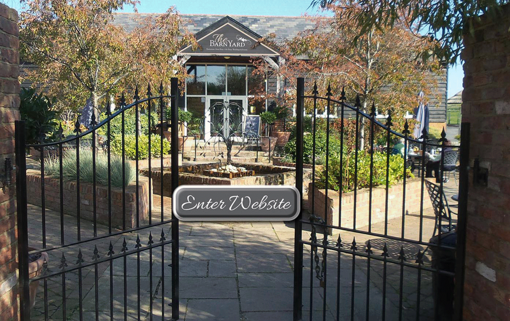

12 June 2018

PLACES TO VISIT Part 5 - The Barn Yard

Thanks to Jean Gammons for the following article:

Click on the poster to

visit their website.

The Barn Yard, near Sittingbourne.

Situated in the Kent countryside in Oak Lane, Upchurch, the BarnYard is a haven for those wishing to escape the hustle and bustle of everyday life.

The venue incorporates a restaurant, luxury artisan farm shop, French inspired 'vintage' themed gift shop selling beautiful home and garden wares (The Giggleberry Tree) as well as being known as one of Kent's best and most beautiful wedding venues.

There is literally something for everyone to enjoy at The BarnYard.

The farm shop and gift shop is open from 10am to 4pm (at weekends from 9am). The restaurant from 9am.
