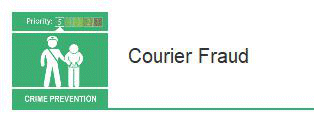

19 June 2018

Fraud Alert

Thanks to Neighbourhood Alert for sending us the following alert and also a link to the new section of their website giving a wealth of information on 'Building Safe Neighbourhoods' :

Click on the poster

for more details.

The National Fraud Intelligence Bureau has identified an increasing number of reports submitted to Action Fraud from the public concerning courier fraud.

Fraudsters are contacting victims by telephone and purporting to be a police officer or bank official. To substantiate this claim, the caller might be able to confirm some easily obtainable basic details about the victim such as their full name and address. They may also offer a telephone number for the victim to call to check that they are genuine; this number is not genuine and simply redirects to the fraudster who pretends to be a different person.

To read the full alert, please click on the poster (above left).

---

To visit the new 'Building Safe Neighbourhoods' section of Action Fraud's website that gives a wealth of information to help keep us and our neighbours safe, please click on the poster (left).
