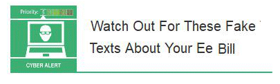

20 June 2018

Fraud Alert

Thanks to Neighbourhood Alert for sending us the following fraud alert :

Click on the poster to

view the original message.

Watch Out For These Fake Texts About Your Ee Bill

These fake text messages purport to be from EE and claim that you haven't paid a bill.

The link in the message leads to a phishing website designed to steal your EE account login details, as well as personal & financial information.

Don't be tricked into giving a fraudster access to your personal or financial details. Never automatically click on a link or attachment in an unexpected email or text.

For more information on how to stay secure online, visit [www.cyberaware.gov.uk](http://www.cyberaware.gov.uk)
