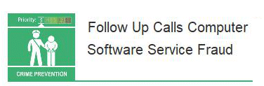

20 June 2018

Computer Software Service Fraud Alert

Thanks to Neighbourhood Alert for sending us the following fraud alert :

There is concern that victims of previous Computer Software Service Fraud (CSSF) are being re-targeted for 'owed money'. The National Fraud Intelligence Bureau (NFIB) reports that CSSF scammers are returning to contact previous victims, requesting that they pay money owed for a fake malware protection service they had provided. Alternatively, the fraudster will ask for a new subscription fee in return for protection from a new threat. The victims that have made payments to the fraudsters have done so via credit/debit card payments. In some instances threatening and aggressive language has been used against victims, as part of the attempt to coerce them into sending money.

Click on the poster to

view the full message.

Computer Software Service Fraud involves the victim being contacted, told that there is a problem with their computer, and that for a fee this issue can be resolved. The aim of the fraudster at this point is usually to gain remote access to the victim's computer and, subsequently, access to their online banking account. No fix actually occurs. The victims will often be cold­called or will receive a pop­up on their computer, prompting them to phone the suspect.

Since the beginning of this year (2018), the total loss for repeat victims of CSSF has been reported as £16,712.85. The National Fraud Intelligence Bureau has noticed an increase in such reports since the beginning of May.

To read the full alert and get advice on how to protect yourself from these fraudsters, please click on the poster (above left).
