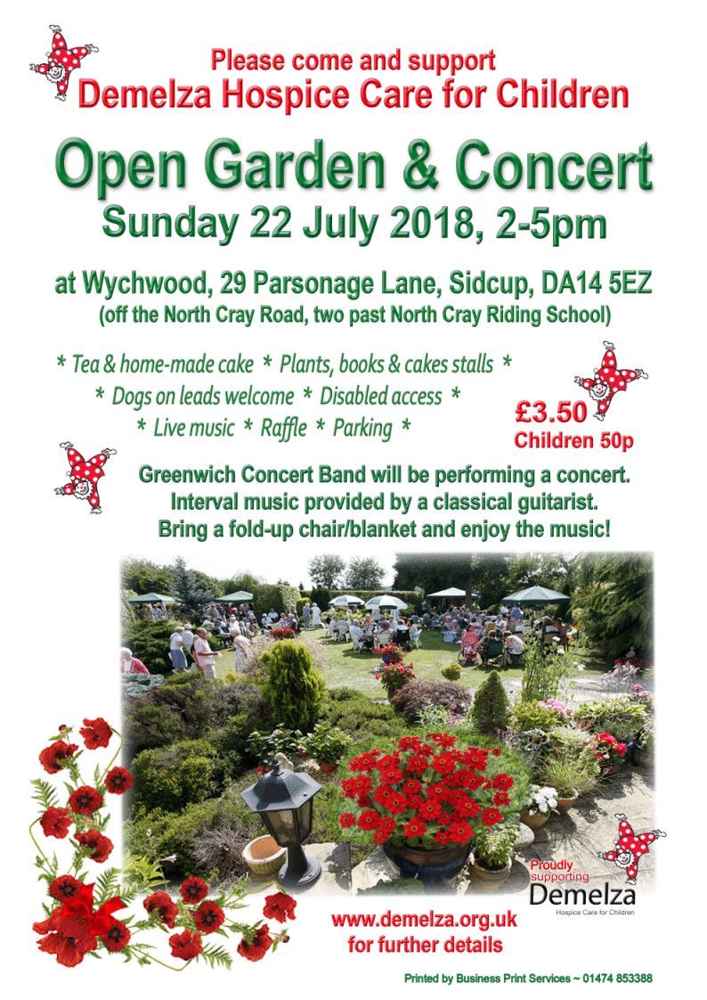

26 June 2018

Open Garden & Concert

David and Jacky Cook have held Open Garden charity events in the past, mostly for hospices, in their garden in Parsonage Lane and they have agreed to do so again, this time for Demelza Hospice Care for Children.

They are keen gardeners and their large garden is ideal for holding such events. This will be held on the afternoon of Sunday 22 July from 2-5pm at Wychwood, 29 Parsonage Lane, Sidcup, DA14 5EZ and if you are free on that day they would be delighted to welcome you to this event.

There will be refreshments and home-made cakes served by the hardworking Demelza staff and volunteers and there will be numerous stalls - typically plants, books, jewellery, raffle, tombola, homemade jams/chutneys or similar. Greenwich Concert Band will once again be giving a concert and a classical guitarist will also be playing during the Band's interval. Entrance is £3.50, children 50p, and the garden is wheelchair-friendly. Please click on the poster for full details.

Click on the poster

for an enlarged view.

Due to the kind permission of a neighbour, parking is in the field opposite provided there has not been excessively heavy rainfall at the time making the field too muddy for car parking (hopefully an unlikely event). If so, parking will be in the lanes as directed by the Demelza stewards / marshalls.

Please bring a fold-up chair or blanket and come and enjoy the music and refreshments which will be available all the afternoon.

Naturally it is hoped that the weather will be fine on the day so it is ‘fingers crossed' that it is parasols rather than umbrellas, though there is plenty of shade in the garden if it is very hot.

More details of this event are on the Demelza website -[www.demelza.org.uk](http://www.demelza.org.uk)- under Challenges & Events.

Demelza is a very worthwhile local charity and it is hoped that you will be able to support its valuable work by coming along on the day.

Please contact Jacky Cook on 07885 764578 if you have any queries or wish to be sent a map and directions.
