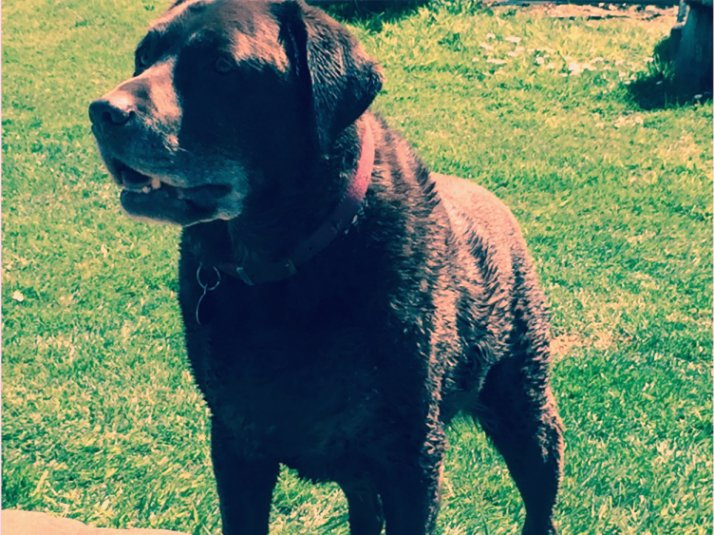

28 June 2018

Dudley March 2004 - June 2018

From David Phillips :

It is with deep sadness that our dog 'Dudley' died of old age on Tuesday evening.

Many people will have known Dudley because he was very much "the dog in the lane", always getting out always where he shouldn't be. In summer I was often amused to watch him come home across the field or through the fences soaking wet having been for a swim, often preferring neighbours pools to our own. He also loved a muddy puddle.

For those who did not know Dudley he was the chocolate brown Labrador, although you may have seen him uninvited on a hack, or turning up at meal times at stables. In particular he was very keen in rummaging out biscuits and cakes from horse riders, builders, GPO men, road workers and alike. He was a simple dog. He did not discriminate; if you had food he would be your best friend.

Dudley was a great dog and had a great life living here in Parsonage Lane. I should like to thank everybody who knew him and treated him with affection. In particular, Jean and Mario who treated him like their own.

He will be sorely missed.
