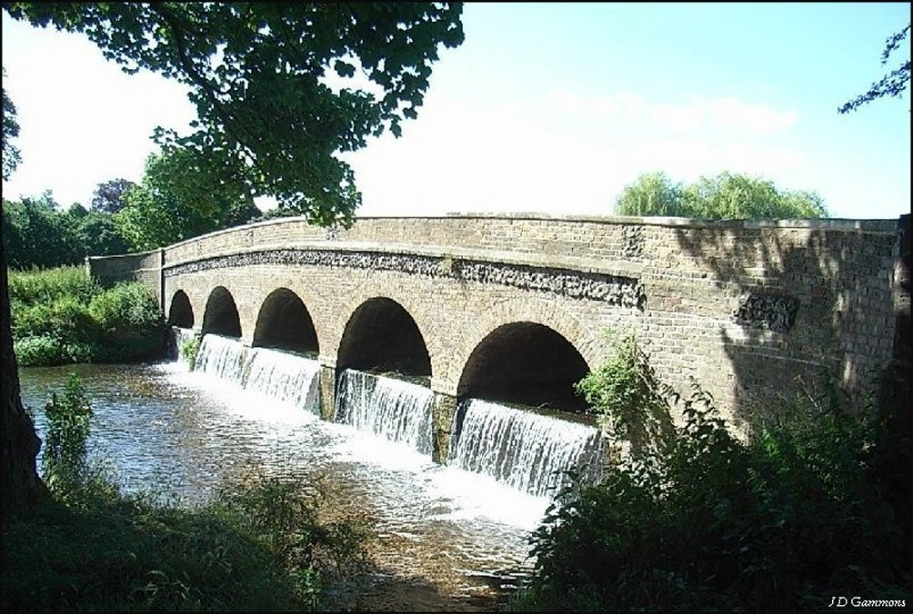
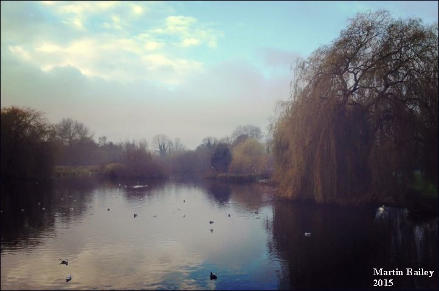

30 June 2018

Meadows Action Group

As so many of you are aware, there have been a number of distressing incidents on Footscray Meadows in recent years affecting our vulnerable Wildlife, as well as aggressive dogs, illegal fishing and Quad Bikes.

There is very little that our Association can do about this increasing problem; but at our AGM on 27 June we floated the idea that perhaps those of our members who frequently visit the Meadows to walk their dogs could form an informal Meadows Action Group - people who could take immediate action whenever they see an incident of this kind taking place by reporting it to those who can take action.

Two members joined straight away - Rosie and Lynne. And our hope is that others will do so too.

The following is useful information for you to have on your mobile phone:

Police

Local Safer Neighbourhoods SNT (St Marys & St James): Phone: 0208 721 2816

Email: BexleyStMary.SNT@met.police.uk

Aggressive dogs - if a person is attacked phone 999.

Dog on dog: phone 101

Quad bikes - phone 101 (they might be able to engage a motor cycle team trained team to pursue them)

Illegal fishing - phone or email SNT, they will try to respond on foot. Also report to the Environment Agency, see below

Environment Agency

Incidents: Phone: 0800 807 060

Contact Centre Phone: 03708 506 506

Bexley Council Warden Service:-

Phone: 0208 303 7777

Hours: 8am-10pm Summer; 8am-4pm Winter. Late Warden 4pm-midnight seven days a week

Note: they can also arrange to call out a dog handler

Local Grounds Maintenance Officer: Patrick English Phone: 07595 4472 Email: Patrick.English@bexley.gov.uk

PLEASE REMEMBER

Do not put yourself at risk.

If at all possible, take a photo as evidence. This might enable our local SNT to recognise the offender.
