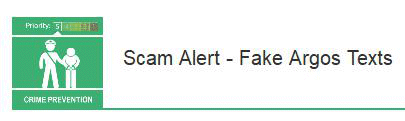

9 July 2018

Scam Alert - Fake Argos Texts

Thanks to Neighbourhood Alert for sending us the following fraud alert :

Click on the poster to

read the full alert..

Watch out for these fake Argos texts offering refunds

These fake text messages purport to be from Argos and claim that you are owed a refund.

The link in the messages lead to phishing websites designed to steal your personal information, as well as payment details.

Click on the poster (above left) for full details.
