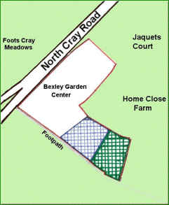

10 July 2018

News from the Secretary - Unauthorised Works at 57 North Cray Road

After a considerable amount of time - especially in recent months when the unauthorised use of their land by Stuarts of 57 North Cray Road for the deposit, crushing and processing of waste (concrete) etc. was causing serious distress to local people in the form of Noise and Dust - the council and the Environment Agency worked together to put an end to this.

Click on the plan for

an enlarged view.

A major contribution to getting these Works stopped was made by the members of our recently formed Sub-Committee. It was their determined and tireless efforts to get something done without any further delay that led to the issuing of a Planning Enforcement Notice that will take effect on 6 August 2018.

The Enforcement Notice was issued by the Council because it appears to them that there has been a breach of planning control, within Paragraph (a) of Section 171A(1) of the Town And Country Planning Act 1990.

The notice relates to two areas of the land at 57 North Cray Road as shown on the plan (above, left). The area hatched blue can be used lawfully for the mixed use of soil screening and manure and soil storage, but may not be used lawfully for the deposit, crushing and processing of concrete. The area hatched green may not be used lawfully for the for the deposit and processing of waste (soil) or for the deposit, crushing and processing of concrete.

The owners, partners and operators of these unlawful activities have been instructed to cease the unlawful operations within 2 months. If they wish to appeal against the Enforcement Notice, they must do so before 6th August 2018.
