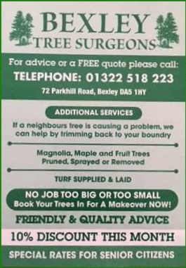

11 July 2018

Fake Tree Surgeon Advertising Leaflets

Thanks to Jean Carne for alerting us to these fake leaflets.

The leaflet shown below and several similar have been posted through residents doors throughout the borough. Blendon and Penhill Police describe them as fake and coming from rogue traders.

The addresses vary from leaflet to leaflet and are addresses taken at random. The phone numbers are routed to a mobile phone. It appears that they are targeting elderly residents with the intention of ripping them off.

Click on the poster

for an enlargement.

Blendon and Penhill Police advise against phoning the number or booking jobs with these people. In general they advise against responding to any leaflet drops for goods or services but instead get recommendations from people you know and who have used the kind of service you are interested in.

If anyone who has CCTV that shows someone delivering these leaflets, please contact Blendon and Penhill Police who want to identify the source.
