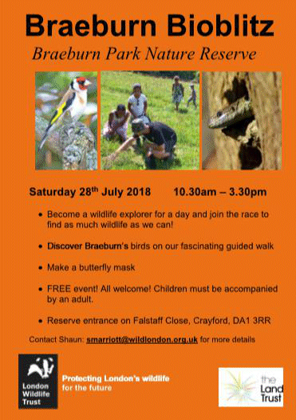
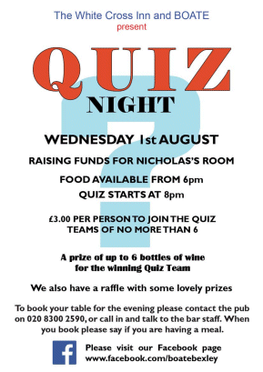

17 July 2018

Two Dates For Your Diary

Click on the poster

for more details.

Thanks to Helen Wallis for sending the following invitation :

Become a wildlife explorer for a day and join the race to find as much wildlife as we can!

Help us survey wildlife, discover Braeburn's birds on our fascinating guided walk, and make a butterfly mask!

All welcome at this free event; children must be accompanied by an adult. Meet us by the entrance at Falstaff Close. Email Shaun on smarriott@wildlondon.org.uk for more details.

This event is being run in association with London Natural History Society and is supported by The Land Trust.

Sat, 28/07/2018 - 10:30am - 3:30pm [MORE INFORMATION](https://www.wildlondon.org.uk/events/2018/07/11/bioblitz-braeburn-park?instance=0)

---

Click on the poster

for more details.

Thanks to Jean Gammons for forwarding the following invitation from BOATE :

We hope you're enjoying our wonderful Summer and thanks for your support this year. Traditionally, BOATE have taken a break from Quizzes in July and August but this year we've decided to run a Summer Quiz night on the 1st August. We will have a Summer theme in some of the questions, a Summery raffle and I will be wearing my fancy Summer shirt. If you want to wear Hawaiian tops or shirts, hats, grass skirts or shorts, we could really get in the mood.

We hope you're able to join us and we would be grateful if you would book in and tell the pub if you plan to have a meal. The number of the pub is 020 8300 2590.

I look forward to welcoming you on 1st August

Kind Regards and Aloha

Steve Brown

Marketing
