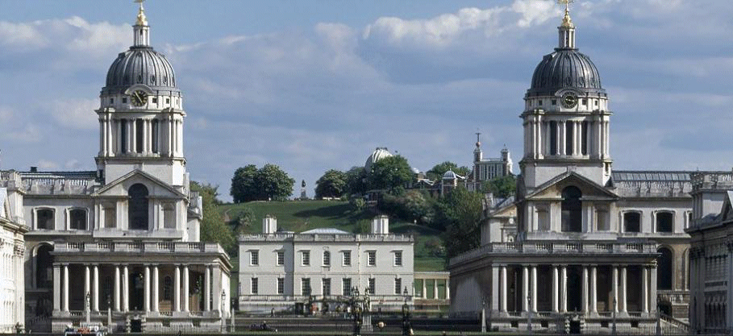

30 July 2018

PLACES TO VISIT Part 7 - Old Royal Naval College Painted Ceiling

Thanks to Eltham Society for sending us the following information :

During the program of works to renovate the painted ceiling there will be a once-in-a-lifetime opportunity to experience this vast masterpiece up close. Visitors are able to climb to a special observation deck, get within touching distance of the UK's largest painted ceiling, and watch the conservators at work as they bring the Painted Hall to life once more.

The works are due to be completed in September and this last chance to view it for over 100 years will end when on September 30th the scaffolding will be taken down.

Click on the poster for more information.
