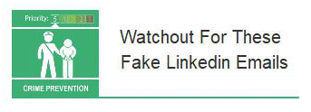
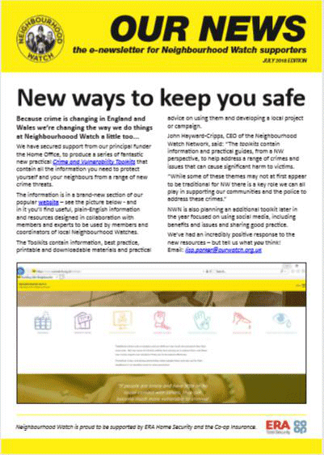

31 July 2018

(1) Fraud Alert - Fake Linkedin Emails

Thanks to Neighbourhood Alert for sending us the following information from Action Fraud :

Click on the poster

for the full alert.

We've received multiple reports about these fake LinkedIn emails. They claim that your LinkedIn profile has appeared in multiple searches and provide links you can click on to get more details. These links lead to malicious websites designed to steal your personal and financial details.

---

(2) Neighbourhood Watch Update :

The National Neighbourhood Watch newsletter is available to download :

Click on the poster

to download.

Thanks to Andrew Davis from the Neighbourhood Watch Office for sending us the latest National Neighbourhood Watch newsletter.

This is available to download by clicking on the poster (left).

It is a good way to discover what local Neighbourhood Watch organisations around the country are up to as well as to stay informed about crime and community-related issues. Well worth a read!
