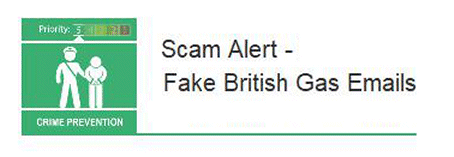

4 August 2018

Fraud Alert

Thanks to Neighbourhood Alert for sending the following Fraud Alert :

Click on the image to

read the full alert.

Watch out for these fake British Gas refund emails.

We have had an increase in reports about fake British Gas emails claiming to offer refunds. The links provided in the emails lead to genuine-looking British Gas phishing websites that are designed to steal the usernames and passwords for British Gas accounts.
