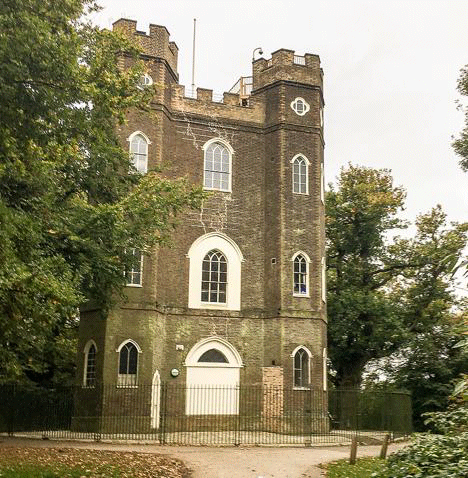

9 August 2018

PLACES TO VISIT Part 8 Severndroog Castle

Click on the image

for more details.

Severndroog Castle is an 18th century Gothic tower built by a heartbroken widow high on a hill in an ancient bluebell wood - Castle Wood, off Shooters Hill. This tower, one of the highest points in London, is community-run and offers a historical visitor experience, with its viewing platform giving some of the most spectacular views in London, along with an exciting events programme that runs throughout the year.

Severndroog Castle is open:-

Autumn/Winter (November-March) Thursdays, Fridays and Sundays: 11:00am-3:00pm

Spring/Summer (April-October) Thursdays, Fridays and Sundays: 12:30-4:30pm

The Terrace Tearoom is open: Tuesday to Sunday, 9:30am to 4pm.

There is no on-site parking, but at Castle Wood there is limited public parking which is a five minute walk from the Castle. The car park can be found along a narrow lane running from Shooters Hill just above Christ Church school, a distance of about 100 yards. There are Brown Heritage signs on Shooters Hill Road pointing to the Castle. See [MAP](https://www.google.co.uk/maps/@51.4669742,0.0590283,16z?hl=en)
