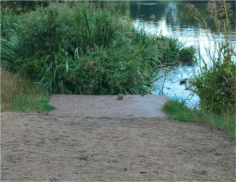

11 August 2018

FootsCray Meadows - Rubbish

Thanks to Mrs Gail Moon for sending the following message :

Click on the image

for an enlarged view.

Hi I am just letting you know that I have today sent an email to the Environment Agency cc'd to Patrick English at Bexley Council about the increasing rubbish problem a Five Arches Meadows.

The Council are unwilling or unable to provide more bins and the situation is now really quite bad. Yesterday afternoon whilst talking with friends at the main bridge I spotted a rat casually walking around (photo attached).

I asked in my email to the Environment Agency if signs could be put up to let people know there are rats in and around the river and warn them of the dangers of Weils disease as there are daily adults, children and toddlers playing in the river.

In the event that neither the Environment Agency nor the Council do anything, please would you be able to at least warn local residents of the dangers.

Many thanks,

Mrs Gail Moon

Editor's Note : Weils disease, also known as Leptospirosis, is a serious water borne infection spread by rats and when transmitted to humans can cause fever, severe jaundice, kidney failure and may be fatal.

The photograph shows a rodent that may be either a rat or a water vole. The presence of water voles are generally considered a sign of good water quality and a healthy environment but they have been shown, along with other wild mammals, to be susceptible to Leptospirosis and may be associated with the spread of this disease to man. NJC
