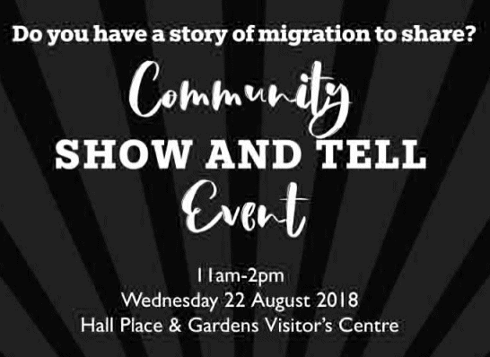

19 August 2018

Community Show & Tell Day 22nd August

Thanks to Danielle Fuller, Co-ordinator, Bexley Safer Neighbourhood Board for sending the following invitation from the Community Partnerships Team at Bexley Council :

'Apologies for the short notice but I am writing to promote an event taking place next week. The Community Partnerships team is supporting Bexley African Caribbean Community Association (BACCA) and The Exchange to put together an exhibition celebrating Bexley's story of migration. The project is funded by the Heritage Lottery and started with the Windrush Community Celebration that took place in June.

Click on the poster

for more details.

We will be holding a Community Show and Tell Event on Wednesday 22nd August from 11am - 2pm at Hall Place, in the classroom next to the cafe, where we are inviting residents to bring objects and photographs that illustrate their story of migration into Bexley.

This can be from people whose parents or grandparents migrated here decades ago or from families who are newly arrived and wish to share their experiences.

We are hoping to borrow, copy or photograph some these objects for use in our exhibition, which will tour around the borough until early 2019.

We are also gathering people's stories via audio recording, so if anyone is interested in having their or their family's story recorded so that it shared and preserved in the Bexley Archive, please get in touch with [princess.adeosun@bexley.gov.uk](mailto:princess.adeosun@bexley.gov.uk)
