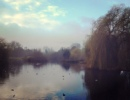

22 August 2018

NCRA contacted a number of officers and councillers from Bexley to ask why trees were being felled at Footscray Meadows. We have to thank Phillip Louis, Bexley's Trees and Woodland officer for the following reply :

Firstly, it's wonderful to see that people are still passionate about the green spaces where they live and I understand that trees are an especially emotive subject, as such I hope that my following explanation will put your mind at ease.

As you may or may not have been aware in recent years the 'islands' within Footscray meadows Lake have begun capsizing, gradually reducing the habitat for swans and other water fowl, creating additional issues to the hydro-dynamics (how the water flows) of the lake and becoming litter traps.

Click on the image

for an enlargement.

There are several reasons for the islands capsizing which include adjustments to water levels and hydro-dynamics within the lake since the 5 arches bridge and weir were repaired/ rebuilt (in the early 2000's), the vegetation on the islands becoming taller and therefore increasing their 'wind sail factor' (wind catches them more) which is further compounded by multi directional wind and relatively open grass plains allowing the wind to effect the islands directly.

Ordinarily a trees root system is sufficient prevent uprooting from wind, however the willows on the island are shallow rooted and due to the depth of the lake are unable to gain any purchase (currently rooting in silt build up), resulting in the loss of islands that we have experienced already.

It is for that reason that under consultation with Local Ornithological experts , the Friends of the Footscray Meadows conservation officer and the London Borough of Bexley's Flood Risk Management officer and the conservation officer it was deemed that my solution to the long term and irreversible loss of habitat for the swans and other water fowl is the best option. With this time of year selected to mitigate the impact on the wildlife.

The vegetation on the lake (willows and some poplar) are very responsive to the traditional management style of coppicing and by carrying out this work cyclically (every 6 -12 years) it will minimise the potential for the islands to either submerge under the vegetative weight or capsize. It is highly likely that by late spring there should be regrowth from the coppice stools.

I understand that it may look like a dramatic change in the landscape, but this is temporary whereas the complete loss of the islands would be permanent.
