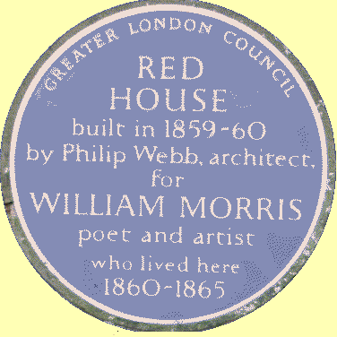

13 September 2018

LOCAL SOCIETIES & ORGANISATIONS - Part 8 Friends of Red House

Click on the blue plaque

for more details.

The Red House is situated in Red House Lane, Bexleyheath, DA6 8JF. The Friends of Red House were established in 1998 to help keep the house open to the public. When the National Trust acquired the House in 2003 the Friends were asked to continue their work there, particularly in providing tour guides; staff for the shop and tea room; and gardeners.

The Friends also offer practical help and support towards the maintenance, restoration and conservation of Red House and its garden. They have, for example, funded several items of garden equipment and contributed towards the cost of replacing the main gates.

They publish a newsletter three times a year, which is sent to members; and promote Red House through lectures and a website. Social events, and outings, linked to William Morris and the Arts and Crafts movement are organised. As part of their fund-raising work, they also run a second-hand bookshop in the building at the house that used to be Morris' stables.

Membership: Adult £10 Family £15
