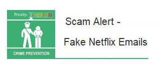

14 September 2018

(1) Fraud Alert (2) Neighbourhood Watch Update

Thanks to Neighbourhood Alert for sending the following Fraud Alert :

Click on the image to

read the full alert.

Watch out for these fake Netflix emails.

We've seen an increase in reports about fake Netflix emails claiming that there's an issue with your account, or that your account has been suspended.

The email states that you need to 'update' your account details in order to resolve the problem.

---

Thanks to PCSO Pauline Cimen from Police SNT Team for the following update :

| Overnight from Tuesday / Wednesday 4th-5th September a vehicle was broken into on Parkhurst Road Bexley.Blue Badge & I Pod stolen. No CCTV of this incident taking place.                                                                                                                                                                                                                                                                           |
| :-------------------------------------------------------------------------------------------------------------------------------------------------------------------------------------------------------------------------------------------------------------------------------------------------------------------------------------------------------------------------------------------------------------------------------------------------- |
| A burglary took place in North Cray Road on Wednesday 5/9/18 from 0820-1145hrs. Occupant arrived home to find jewellery box discarded on their driveway. Property is a bungalow and suspects have smashed a bedroom window reached in and stolen the jewellery box. It is possible they have disturbed the suspects hence some of the items discarded. The Local team have completed neighbour & CCTV enquires. The investigation is still ongoing. |
| On Thursday 6th September between 1850- 2000hrs a motorcycle was stolen from outside the victims address in Ellenborough Road.The owner is still in possession of the keys. With have shown this vehicle as stolen on our police computer systems and if it so happens to pass an automatic number plate reader camera it will flag up to local officers who will pursue. There is no CCTV of the incident itself.                                  |
| On Monday 10th September between hours of 2130-0722 a car was stolen from the drive in Harvill Road. No suspects seen.                                                                                                                                                                                                                                                                                                                              |
| On Wednesday 12th September 2018 between the hours of 0015-0030 criminal damage to place to a vehicle parked in Palm Avenue. Not items were taken from vehicle.                                                                                                                                                                                                                                                                                     |
| On Wednesday 12th September 2018 around 2118 hrs a van was broken into at the car park of the Holiday Inn hotel. Window had been smashed and tools had been stolen from the van. If you reside in any of the roads and you have information that could assist police please call 101 number. Please view any CCTV you may have.                                                                                                                     |
| Email: stmarys.stjames.snt@met.police.uk Tel: 020 8721 2816 Twitter: @MPSStMarysRY                                                                                                                                                                                                                                                                                                                                                                  |

---

Thanks to Dana Wiffen, Chairman, Neighbourhood Watch Office for sending the following Burglary Update & Invitation to a 'Meet & Greet' :

From the figures we were given last week, burglary was at 8 and attempted burglary also at 8. The number of attempted break ins may be reflecting the fact the residents are making their homes more secure and this is thwarting burglars which is good news. Also alert neighbours disturbing them may also be a plus. Please be alert as we continue to try and deter these thieves. BURGLARY ALERT: Asian Gold is again being targeted in this Borough please ensure all your valuables and kept safe and if you are going to be away from your property ask your neighbour to keep an eye on home.

As you may be aware the ward boundaries which divide the borough of Bexley changed in May of this year, this has meant that the ward you live in may have changed and the Safer Neighbourhood Team which Police your area may also have changed.

The St. Mary's & St. James' Safer Neighbourhood Team & BBNWA would like to invite you to a 'Meet and Greet' at the Old Dartfordian's Community Sports Club on Thursday 18th October 2018, between 6pm to 8pm.

This will be an opportunity for the residents of the ward to meet the team who police the area they live and work in, as well as meet with a Committee Member from Bexley Neighbourhood Watch...

Hope to see you there on the day. .

---

Thanks to Hound Watch for the following message :

We have had three reports of rough sleepers in the borough over the last week. Tents have been pitched in Bexley Woods adjacent to West Woodside and Hall Place North (close to Halcot Avenue). A rough sleeper has also been spotted in Lesnes Abbey on the green by the Huw Hedge (close to the coffee shop).

If you are a dog walker please contact us asking to become a Hound Watch member and you will be informed of reports such as this.

---

Thanks to PCSO Augustine Gomes, Police SNT Team for the following message :

VEHICLE: Having your car broken into and losing your things to thieves can be very distressing. Here are a few simple steps you can take to keep your vehicle, and what's in it, safe.

1. Always lock it.

2. Close windows and the sun roof to prevent 'fishing'.

3. Secure your number plates with tamper-resistant screws.

4. Fit locking, anti-tamper wheel nuts to secure alloy wheels.

5. Secure anything that's on the outside of your vehicle

6. Take it with you or hide it.

7. Hide electrical items and leave no clues.

8. Take your documents with you.

9. Park in well-lit and busier areas.

10. Choose your car park wisely Don't leave it on display in your home .

Thieves are known to target bedrooms and lofts. Invest in a safe security fixed to a brick wall or use a bank safety deposit box to store high value items. Be discreet if wearing jewellery in public. Photograph each piece of valuable gold or jewellery, keep a written description and get a valuation from your insurance company in case it is stolen. Make sure your jewellery is property marked with a product suitable for jewellery .Visit: www.securebydesign.com for more information.

BURGLARY: Lock all external windows and doors including rear and side entrances when you go out. Review your current home security arrangements to ensure that they are adequate. For more information visit

[www.met.police.uk/crimeprevention](http://www.met.police.uk/crimeprevention)

Be aware that thieves sometimes ring the doorbell to check whether someone is in. If someone unexpected comes to your door and you are suspicious, call 999 and give details such as a description of them, their car and licence plate. They may ask for someone you don't know or offer services such as gardening as an excuse.
