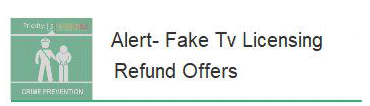

22 September 2018

Fraud Alert - Fake Tv Licensing Refund Offers

Thanks to Neighbourhood Alert for sending the following warning from Fraud Alert :

Click on the image to

read the full alert.

Watch out for these fake TV Licensing emails.

We've seen a sharp increase in reports about fake TV Licensing emails claiming to offer refunds. The emails state that the refund cannot be processed due to 'invalid account details'. The links provided in the emails lead to phishing websites designed to steal personal and financial details.

Always question unsolicited requests for your personal or financial information in case it's a scam. Never automatically click on a link in an unexpected email or text.
