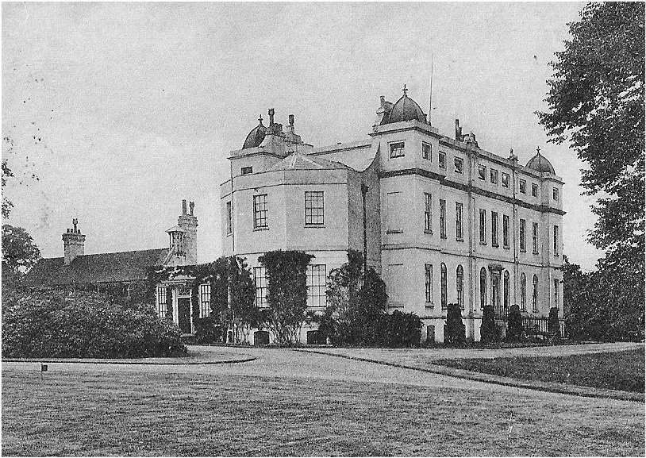

23 September 2018

Auction of the Mount Mascal Estate

Click on the image to

see the catalogue.

Our thanks to John Window of Little Mascal Farm, Cocksure Lane, for sharing with us his catalogue of the auction of the Mount Mascal Estate in 1949.

The catalogue shows buildings such as the former mansion of Mount Mascal and its several outbuildings,

Included are The Lodge in North cray Road, being the orignal entrance to the estate; Home Close Farm; The White House in Cocksure Lane; The Red House on Bunkers Hill and various other buildings in The Village. :
