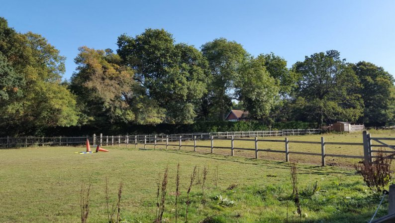
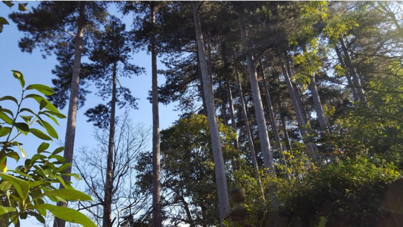

1 October 2018

Tree Preservation Orders in North Cray

Thanks to Jean Gammons for the following article :

Trees not only contribute much to the street scene, they are also important for our mental and physical well-being. They are particularly important where air pollution from traffic exists, for example along the North Cray Road, or from the unacceptable dust-creating commercial Works carried out at No. 57 over the past year or so.

Parsonage Lane protected trees.

Fortunately, many Tree Preservation Orders (TPOs) exist in the London Borough of Bexley, including sixteen in North Cray and we should be thankful to the council for the care it takes of our trees and for their recognition of the importance of the positive contribution they make to our environment. In particular for creating two Conservation Areas in North Cray (High Beeches and The Village) where trees are regarded as an important feature in the street scene.

Protected trees at Little Mascal Farm.

Sadly, however, no TPOs exist for the beautiful mature trees bordering both sides of the North Cray Road, which have for some 50 years done so much to soften the appearance of the dual carriageway, a road which divided our Village into two and, in its making, lost to us many of North Cray's centuries-old buildings.

NCRA wishes to thank John Macauley, Planning Enforcement Manager for London Borough of Bexley for supplying the following maps with areas hatched in red to show the location of the sixteen TPOs in North Cray :

[Bunkers Hill, Home Wood & Gattons Wood](http://www.northcrayresidents.org.uk/tpos/bunkers_hill_home_wood_gattons_wood.pdf)

[High Beeches & Ellenborough](http://www.northcrayresidents.org.uk/tpos/high_beeches_ellenborough.pdf)

[Home Close Farm, The_Grove & The Meadows](http://www.northcrayresidents.org.uk/tpos/home_close_farm_the_grove_the_meadows.pdf)

[Home Wood & Gattons Wood.pdf](http://www.northcrayresidents.org.uk/tpos/home_wood_gattons_wood.pdf)

if you have a suggestion for any trees that you feel should have the protection of a TPO, your suggestion should be addressed to the Head of Development Management, whose email address is [developmentcontrol@bexley.gov.uk](mailto:developmentcontrol@bexley.gov.uk)
