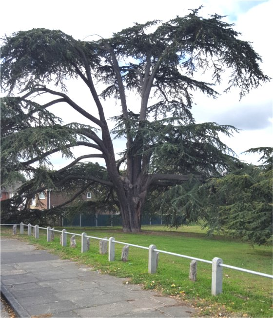

4 October 2018

TPOs in North Cray - Appeal for Information

Following the article by Jean Gammons on Tree Preservation Orders in North Cray, Jean has made the following request for information :

I went to photograph the two 'Capability Brown' Cedars planted circa 1782 on the Meadows near to The Spinney so that I could send them to Bexley with my request to issue a TPO to protect them, but I was only able to see one.

It seems from what one of our members now says, that one of the two that she remembers has been lost for some reason at some time.

Another member remembers as well that there used to be two and is going to ask his parents what they remember.

It occured to me that perhaps we could appeal through a NewsMail to see if anyone remembers when and how the other one was lost, and whether anyone perhaps has a photo of it?

If you have any information and or a photograph, please let Jean know via the 'Contact NCRA' link on any NCRA NewsMail.
