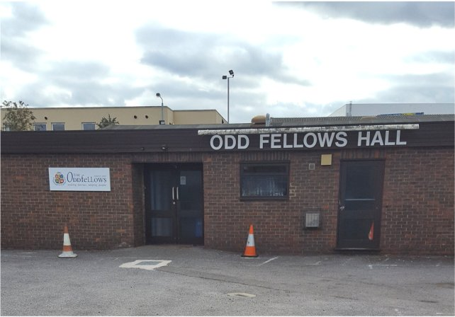
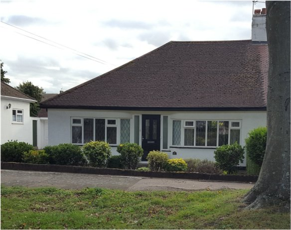

6 October 2018

HISTORY OF OUR ASSOCIATION: Part 1 Its formation in 1944

In this proposed series, which begins in 1944 with the formation of our Association (NCRA), Jean Gammons tells the story that is revealed in its minutes, explaining too what was going on at the time in the world at large. The purpose is not to look inward at the NCRA, but - through the minutes of its meetings - to tell the story of our Village and its concerns as it evolved from being a largely rural community into what it is today, a suburb in an outer-London borough. Jean writes:

In 1944 World War 11 had not yet ended; but June 6 had seen the Allied invasion of Europe. London and Kent were still suffering from flying bombs, and schools had 'doodlebug spotters' - children in tin hats taking turns to watch the sky. By July 31, Kent had been under attack by flying bombs for six weeks, and homes in scores of towns had been destroyed or damaged. By September, the blackout had been replaced by a dimout, and in October the various units of the Kent Home Guard were told that their services were no longer needed as there was no longer a risk of invasion. But pig-bins remained in most roads, to collect food scraps for pig-swill.

On 23 March 1944 - as the people of North Cray were emerging from the dark days of World War 11 - a meeting took place at the Oddfellows Hall in Footscray.

It was attended by 27 of North Cray's ratepayers and was chaired by Councillor Townley of the Chislehurst and Sidcup Urban District Council. The result was the formation of the North Cray Ratepayers Association. Key Officers were appointed: Chairman, Mr Nevill (who lived at No. 21 High Beeches); Hon. Secretary, Mr Collis and Treasurer, Miss E McNeill. The supporting Committee members were Mrs O Sullivan, Mr P Reed and Mr Morgan. The latter was especially welcomed on board as it had been his idea that the new Association should be formed. Everyone present then paid their first year's subscription of two shillings plus an entrance fee of 6d.

Five days later, at No. 21 High Beeches, the new Committee met for the first time.

Discussed were the proposed Constitution and Rules and the holding of a Dance 'to make the Association known a bit more and to make finances for it'. However, the latter was left in abeyance, the meeting agreeing that 'it was the older people you had to get interested, not the young'. The finances stood at £3.7.6d.

The Committee met again on 11 April, when it was agreed that the Secretary should write to the Council about the new-style pig bins.

Seven months later, on 17 November, again at No. 21 High Beeches, the Committee held another meeting. This time, the Secretary was asked for information about claims for Damage by Enemy Action, such as false teeth and carpets; and where First Aid starts and finishes. It was also agreed that there should be a Pantomine at Christmas for the benefit of the Association. Disappointingly, it is not recorded if this event ever took place, and if it did where.
