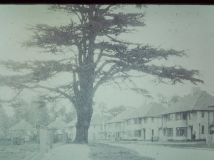
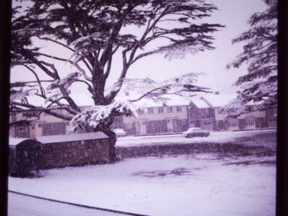
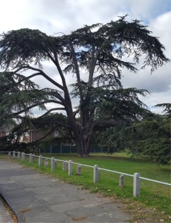
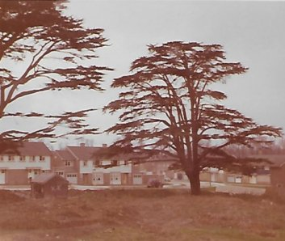

9 October 2018

LOST CEDARS OF LEBANON: MEMBERS' MEMORIES OCTOBER 2018

Thanks to all those members who sent in their recollections of the Cedar Trees in North Cray which Jean Gammons has collated as follows :

From Norman:

The other Cedar and the one shown in the photograph were wind damaged some years ago. The Council deemed the missing Cedar to be beyond saving, despite it appearing to be OK, some claptrap about rot, and cut it down. The remaining Cedar was 'butchered' at the same time. The young Cedars around the Spinney/Grove were planted as an after thought to placate residents.

There was another Cedar, partially on the pavement, at the beginning of The Grove, which blew down in a storm and was removed by the Council. Hence the unusual width of the pavement at this point.

Finally, there was another Cedar in the front garden of a house opposite the corner of The Grove/ Spinney which may no longer be there.

From Martin:

The other cedar was taken down some 5 years ago by the Council, due to it being diseased/ rotten/ dangerous. 4 or 5 small ones were planted as long term replacements

From Marie:

Regarding the two Cedar Trees in the meadows near to the Spinney. I recall one of these was chopped down several years ago which the council said at the time was due to storm damage which had made it unsafe. There was also one close to St James Church which was chopped down for the same reason.

From John:

Reference to the Capability Brown cedars, the missing cedar on the corner of The Spinney and The Grove was felled I can't remember the year. It was before 2015 I think. Both the cedars had suffered from a bad winter storm, the missing tree had three main branches and the storm had split the trunk. It was repaired and the branches cabled together but further wind damage caused it to split more. I have some photos of the tree but not complete.

Another Capability Brown cedar which was standing in the Grove near to High Beeches which would have been behind the lodge was felled. I think it annoyed the neighbours. I can't remember when but it was standing in 1966. Another cedar was felled again, I think it annoyed the neighbours. It stood majestically between the detached houses in The Grove near St James church. Two other cedars were felled again one was considered a nuisance the other suffered storm damage I have a picture of them taken from my garden. A copper beech which was I think a contemporary and which was also magnificent was felled as it must have been considered a nuisance. I have two slides of the missing cedar on the corner of The Grove and the Spinney

There are two remaining cedars which are between The Grove and St James Way, I imagine it is only a matter of time before these also are considered a nuisance.

From Charlie:

I believe I may be able to fill in a few gaps 're the second Cedar tree. We moved into The Spinney in 1995, our house being opposite the Cedar in the photo. The other huge Cedar was sited about 50 yards away, close to the corner where The Spinney and The Grove meet. That tree was as large and impressive as the remaining one, but had a problem. The trunk had formed into a 'Y' shape about three quarters of the way up, and at some time the joint of the Y had split. Action was taken to prevent the arms of the Y from breaking away under their own weight by joining the 2 together with 2 steel cables which seemed to have the desired effect, although the crack was always clearly visible and never going to improve.

I'm not certain exactly when it was decided that the tree had reached the point where it was unsafe, nor am I sure that it was the crack that was the issue, but it was deemed unsafe. I think from memory it was in the early years of the 2000's. The tree was felled, and all that now remains at that site is a hump in the ground where the roots were.

The remains of the trunk were cut into sections and placed in the meadows as habitat for wildlife. They can still be seen at the rear of the houses in The Spinney, a couple of hundred yards from where it once stood.

It was not long after this tree was felled that the current new Cedars were planted, and they appear to be doing very well.

From Terry:

For your records, there is a very large Cedar to the right of the old converted stable block on the way to Foots Cray Meadows 'Visitor Centre'.

Also in that vicinity there is a line of very large London Plane trees together with some Oaks that I would imagine were planted at around the same time as the Cedars, not to mention the avenue of Sweet Chestnut trees in the meadows that run alongside Rectory Lane from All Saints church to the meadows visitor

To see the correspondence between NCRA and Bexley requesting TPOs, please follow this [LINK](http://www.northcrayresidents.org.uk/letters/tpo_request.pdf)
