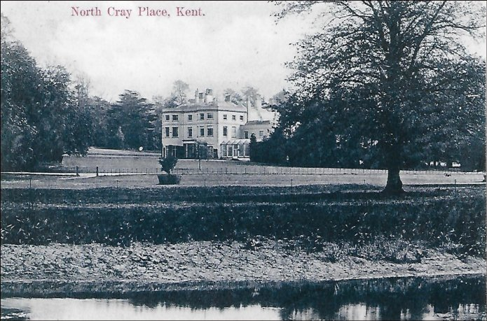
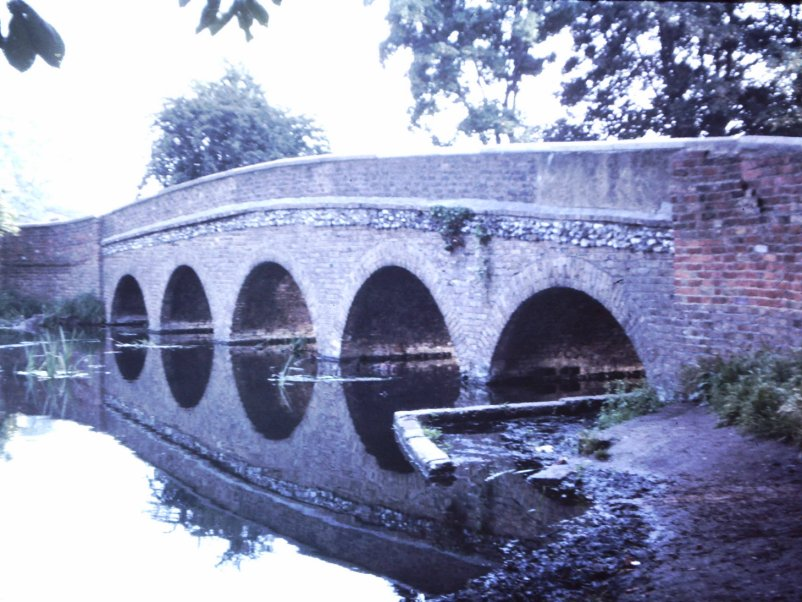

10 October 2018

HISTORY OF OUR ASSOCIATION Part 2 1945

In this series, which began in 1944 with the formation of our Association (NCRA), Jean Gammons continues with the story that is revealed in its minutes for the year 1945 whilst also describing events in the world at large. Jean writes:

At the start of 1945 V2 rockets were still falling on Kent - including Bexleyheath and Orpington - but by the end of April the Allies had captured Berlin, Hitler was dead and on 9 May the war in Europe was over at last. In June the demobilisation of British troops began, and in July 1,700 Kent Land Girls stood down in a celebration in Canterbury Cathedral. Britain was ablaze with light once more, the great switch-on having taken place on the 15th after 2,000 nights of blackout and dimout. But the war in the far-east continued, with reports coming in of atrocities by Japanese captors to Allied prisoners of war.

The Association's first Annual General Meeting took place on 1 June 1945, at North Cray Place. The main question asked was about cesspools (little mains drainage then existed in North Cray), when the Chairman answered that action had been taken but without success.

The Committee met on 27 August when it was reported that the Secretary, Mr Collis, had resigned and that the task had been assumed by Mr W E Terry. Discussed was Street lighting, Gas, Drainage and street maintenance, Bomb damage and the removal of the Air Raid Warden's shelter at High Beeches.

Another General Meeting was held on 8 November at North Cray Place, with 42 members attending. Discussed was the urgent need to reorganise the NCRA and to increase its membership to enable it to play a more active part in local affairs, since matters such as Lighting, Street maintenance, Transport services, Mains drainage, Tree trimming and Bomb Damage repairs could only be satisfactorily settled by a strong Association. The meeting also unanimously agreed that Street Organisers should be appointed, who could also collect subscriptions. Other business was The Dump on the Estate (presumably North Cray Place), which should be stopped; notice boards for members; the footpath along the North Cray Road, the cowgate at the junction of the footpath across Beden's Field and the North Cray Road, and the danger from trees dying because of smoke. The proposal that Street Organisers should be appointed was carried unanimously. The accounts stood at £1.17.0d.

The Committee met again on 13 November, when it was agreed that the new Road Stewards should be: Mr May (of No. 181 Maidstone Road) for Maidstone Road, Mrs Goode (of Grayme, Barton Road) for Honeydene and Barton Roads, Secretary Mr Terry (of No. 21 North Cray Road) and Chairman Mr Peacock (of Monks Orchard) for the North Cray Road, Mr Nevill (of No. 21 High Beeches) for High Beeches, Mrs Pigott for The Grove, Mr Hopton for The Spinney and Mr Lewis (who lived in the School House) for The Village.

Action for immediate attention was the lighting on the North Cray Road (insufficient on account of trees); paving stones on the Estate that required relaying; the footpath over fields that required a barrier at the North Cray Road end to prevent accidents; the removal of Emergency water butts; the permanent repair of the Five Arch Bridge (requiring a letter to the Council); the state of the river (requiring referral to the Kent Catchment Board) and the dumping of rubbish, now stopped; but a suitable notice board needed to be erected to warn the casual dumper.
