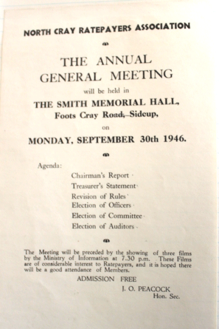
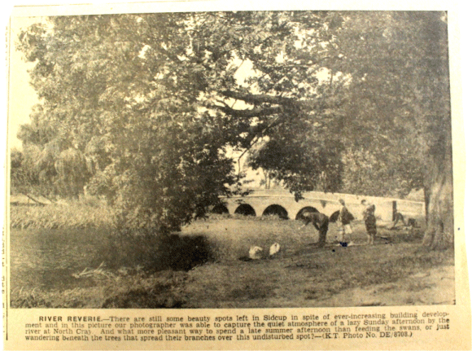

15 October 2018

HISTORY OF OUR ASSOCIATION Part 3 1946

The series continues with the minutes for the year 1946 and also describes the events in the world at that time. Jean writes:

In February, a world food crisis meant that all rations were to be reduced; but on the 15th bananas were being sold for the first time since 1939. In March, Churchill warned of an 'iron curtain' descending across Europe. On the 28th it was announced that schoolchildren were to get free school milk and dinners. In September 'Meopham New Town' offered hope for the homeless; and two thirds of Britain's 60,000 new houses were to be 'pre-fabs'. In October ten top Nazi war criminals were hanged at Nuremberg. In November a new kind of pen, 'The Biro', was invented.

On 11 January 1946 a Committee meeting was held at No. 8 The Spinney. The discussion focused on what form the village Memorial should take - a Playing Field as a Memorial?

At its meeting on 18 March it discussed the removal of the Air Raid Wardens' Posts at High Beeches and Mount Culver, the bomb damage opposite No. 61 North Cray Road and stopping dumping at North Cray Place.

On 16 April a Committee meeting was held at Grayme, Barton Road. Three major concerns were discussed and action agreed:-

- conditions at Mitchell's Farm which should be the subject of a letter to the Council. General cleanliness was poor - bottles were so dirty as to affect the keeping qualities of the milk, and it had been known that bottles were put in the river to cool the milk.

- there were gypsies in the woods (Chalk Wood) on Mount Misery

- if sewage could not be emptied at night, then it should not be done between the hours of noon and 2pm.

The June Committee meeting was held at No. 12 The Grove, when concern was expressed about the untidiness caused to the roads and the district by the firm Antimistant Ltd on the North Cray Road - which operated at the rear of the Coach House and stables of the former Rectory.

The AGM was held on 30 September at the Smith Memorial Hall, Footscray, Sidcup. About 50 attended and the business was preceded by films shown by the Ministry of Information. The number of members was now 64, and the balance of accounts stood at £4.4.10d.

At the Committee meeting on 12 November it was noted that complaints had been received regarding the activities of Mr Wright at No. 65 North Cray Road. The amount of livestock kept by him behind his house was increasing, and the erection of huts contemplated. Some barbed wire had been erected and damage to a footpath had been caused by his lorry.

It was also noted that there were conditions in the covenants of houses on 'the estate' [North Cray Place Estate] which forbade livestock; and gypsies were in residence at the Home Farm (this had been reported by Mr Wright!).

The minutes also referred to the new prefabricated houses in Parsonage Lane (in what was to become Gattons Way).

At the last meeting of the year, on 12 December at Monks Orchard, it was agreed that the UDC should be urged to set a speed limit of say 10mph on the North Cray Road.

Back in the summer, the Kentish Times had reported "There are still some beauty spots left in Sidcup in spite of ever-increasing building development and in this picture [see below] our photographer was able capture the quiet atmosphere of a lazy Sunday afternoon by the river at North Cray. And what more pleasant way to spend a late summer afternoon than feeding the swans, or just wandering beneath the trees that spread their branches over this undisturbed spot?"
