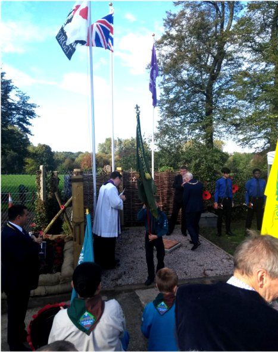
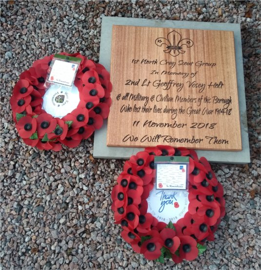
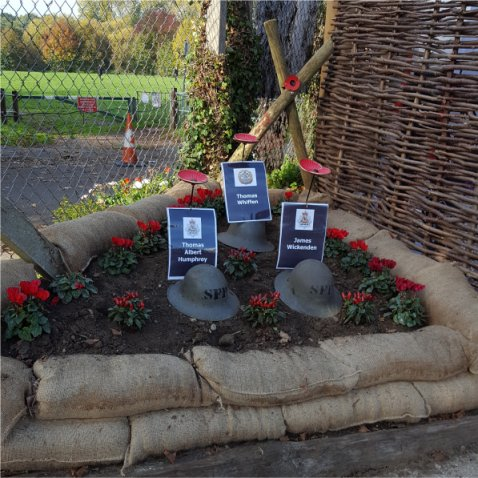
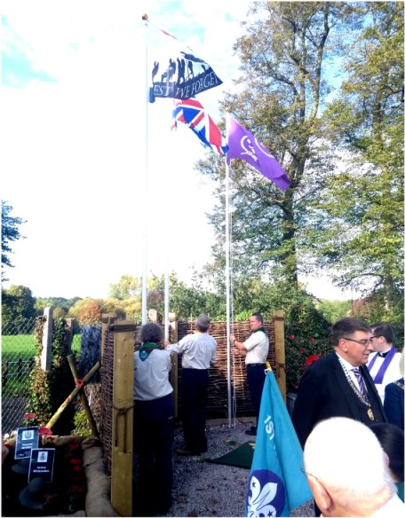
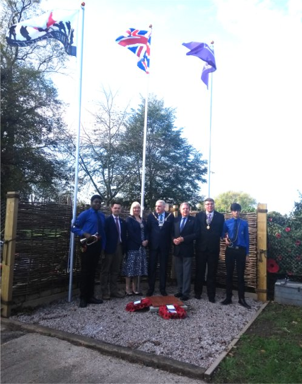

22 October 2018

Scout Memorial Ceremony.

Thanks to Jean Gammons and Chris Moon for the following account of the Scout Memorial Ceremony held at Geoffrey Hall on Saturday 20th October :

Saturday 20 October proved to be an unforgettable day, with many moving moments, when, in the company of some of my Committee colleagues, and local historians Sylvia Malt, Malcolm Barr Hamilton and Phil Willson, we attended the unveiling of a Portland stone Memorial to 2nd Lt Geoffrey Vesey Holt.

Geoffrey fell at Passchendale on 2 September 1917, aged just 19. The stone is also dedicated to and commemorates all of the Fallen of the Borough who lost their lives during the Great War 1914-18.

Geoffrey lived at Mount Mascal, and he had served our community as an Assistant Scout Master of the newly-formed 1st North Cray Scout Group.

The young scouts that he had led were so distraught at his death that they were in mourning for a month, and voted to name their scout hall after him: The Geoffrey Hall in Leafield Lane.

1st North Cray Scouts decided to hold the commemoration a week before the launch of the annual poppy appeal and within the centenary marking the last 100 days of the war to be in accordance with the RBL'#ThankYou100' campaign. The Scouts have also volunteered to carry out some clear up and preparation work in St James Churchyard in time for the armistice day service.

There was a good representation of beavers, cubs and scouts, showing that 1st North Cray have been successful in increasing their membership numbers compared to 2 years ago.

In addition to the beavers, cubs and scouts, various dignities attended and gave inspirational speeches. These include our MP James Brokenshire and the Mayor of Bexley, Cllr. Brian Bishop. NCRA were represented and were pleased to give a donation of £50 as a small contribution to the cause.

Click on any image to get an enlargement
