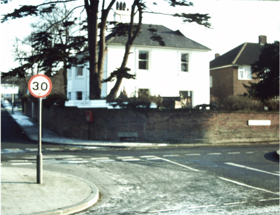
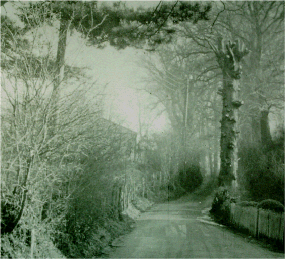

25 October 2018

HISTORY OF OUR ASSOCIATION Part 5 1948 :

Thanks to Jean Gammons for the next episode in the history of the NCRA :

In January the railways were nationalised. In June Russia blockaded the British zone in Berlin, where 200 aircraft a day - The Berlin Air Lift - landed. July saw the introduction of the National Health Service, and August the Olympic Games at Wembley - the first since the Nazi Olympiad of 1936. Sugar rationing was down to eight ounces a week, and sweet rationing cut back at four ounces a week.

At its first meeting of the year, at No. 21 High Beeches on 19th January, the Committee again discussed its concerns about the Fish Shop in High Beeches being used as a Fried Fish Factory. No retail business was ever undertaken and its vans parked on the forecourt were a Nuisance, and the grass verge was being damaged.

At its meetings in April and May, concern was expressed about the damage being done by Mr Wrights cattle (see Part 3) and the building that was going on in The Gattons.

The 1948 AGM was held on 28 September at the North Cray Place Club.

The main business discussed concerned Parsonage Lane: overhanging trees, its lighting and the speed of vehicles. It was noted, too, that allotments had been provided for the pre-fabs in that part of the cemetery field not yet in use. The balance of accounts stood at £11.4.9d

The report of the Chairman, Mr J O Peacock, made the local press under the heading 'North Cray as the towns Forgotten Corner'. Speaking about the Council, he had said '... there has to be constant prodding in matters in which it was their duty to act without any reminder from us, and we have been inclined to feel that we belong to a forgotten corner of the Urban District'.

At its meeting on 4 October, the Committee expressed its concern about the lack of lighting in The Grove, The Spinney and Maidstone Road; and the new outbuildings built by the firm Anti-Mistant Ltd, which operated at the rear of the Coach House and Stables of the former Rectory on the east side of the North Cray Road.
