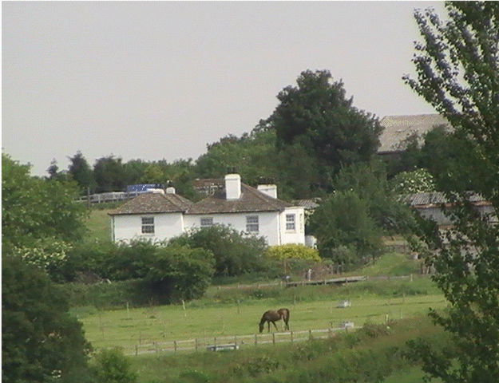

26 October 2018

HISTORY OF OUR ASSOCIATION Part 6 1949

In March clothes rationing ended, and Britain became one of eight countries to sign a new peace alliance - the North Atlantic Treaty Organisation (NATO). In April 12 areas in England and Wales were proposed as National Parks, a Roman villa was being excavated at Lullingstone, and chocolate and sweet rationing ended; but in July sugar rationing was reintroduced and the milk ration cut from three to two and a half pints per person per week. September saw the end of a long, hot, dry summer when the drought had caused a water shortage.

The AGM was held on 29 September at the North Cray Place Club, attended by 114 members.The balance of accounts stood at £13.0.3d. The meeting was addressed by North Cray's new ward councillor, Philip Nash. He said that he deplored the lack of playing fields and was bringing pressure to bear to have them provided as soon as possible - and he expressed his hope that North Cray would no longer be a forgotten corner of the Urban District.

The meeting was informed that the Association had played a part in the recent Public Inquiry into the council's ban on works being carried out at The Gattons in Parsonage Lane by the Norris Engineering Company, manufacturers of containers whose permission to do so had originally been given as a war-time measure.

At its meeting in October, the Committee discussed the Nuisance created by Rooks, dumps of old tarmac left at Ruxley Corner and the pumping of water at Water Lane, causing ground subsidence and threatening the fertility of the land. It was also agreed to ask for the provision of name-plates on all the roads leading from Ruxley Corner.

At its December meeting the Committee noted that Manor Farm had been sold to a scrap-metal merchant and it was agreed that an eye should be kept on this in case it developed into a dump detrimental to the neighbourhood.
