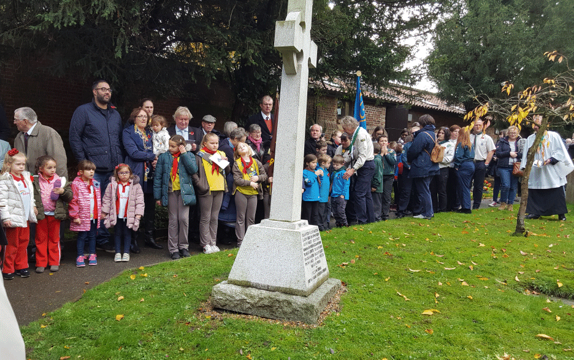
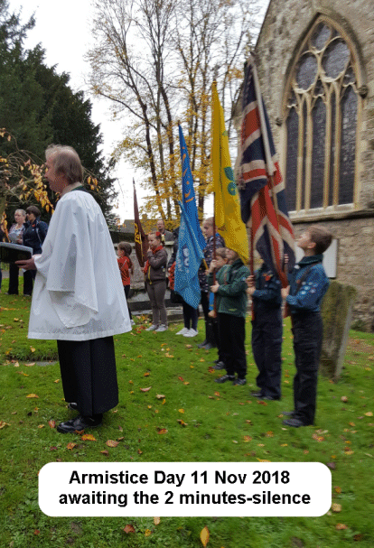
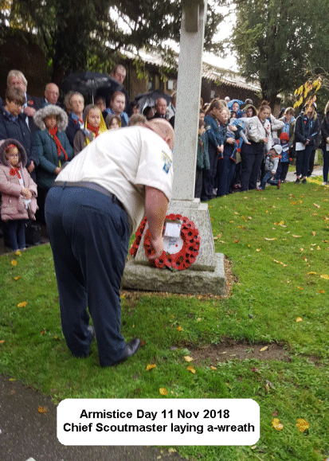
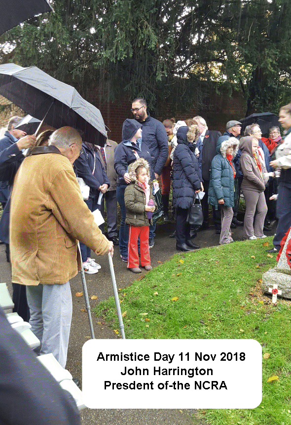
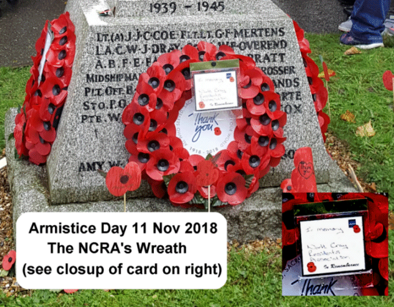

11 November 2018

Armistice Day Ceremony at St James Church

Click on any of the images for an enlargement

On 11 November, St James Church in North Cray was filled to the brim with local people attending for this year's very special Armistice Day marking the end of the First World War in 1918.

Represented were the 1st North Cray Scouts (see our NewsMails of 22 October and 6 November), and moving accounts were read out by some of these young people about the men of North Cray who gave their lives.

Several members of the NCRA attended, including its President John Harrington.

