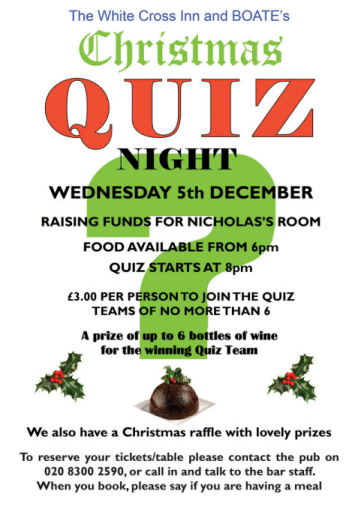

25 November 2018

Quiz Night at the White Cross

Thanks to Jean Gammons for forwarding the following invitation from BOATE :

At our last Quiz Night in November we announced the good news that we've nearly raised the £10,000 we committed to raise for Nicholas's Room. This wonderful achievement is down to the generosity of all of our regulars and I want to thank you personally for your support over the years. Unfortunately, because we've now made our target, the Directors have decided we should now close BOATE.

Our next Quiz Night in December will be the last we arrange but we understand that Colin at the pub is hoping to keep them going starting again in February. As you know under the terms of the General Data Protection Regulation (GDPR), we are not allowed to pass on your e-mail address to someone else. If you would like to be added to the database for the White Cross, please contact Colin on colin_care@yahoo.co.uk and ask to be added to the list for future Quiz Nights.

Click on the poster left for an enlarged view.

If you are interested in joining us for our Christmas Quiz on 5th December we will have Christmas themed question, Christmas decorations and, like last year, it would be fun if we could all wear our Christmas clothes. If you would like to join us for what will be a fun evening, please book with the pub directly either by phone on 020 8300 2590 or call in and talk to the bar staff. When you call, please don't forget to tell them if you're having a meal.

I look forward to welcoming you on 5th December

Kind Regards

Steve Brown Marketing
