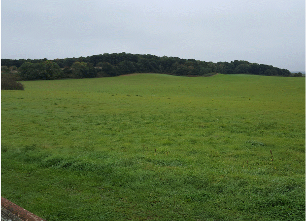
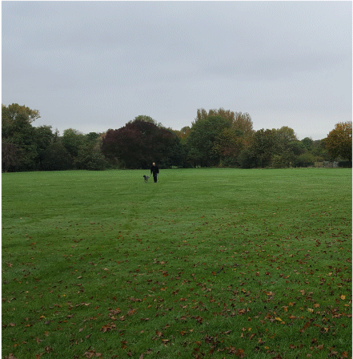
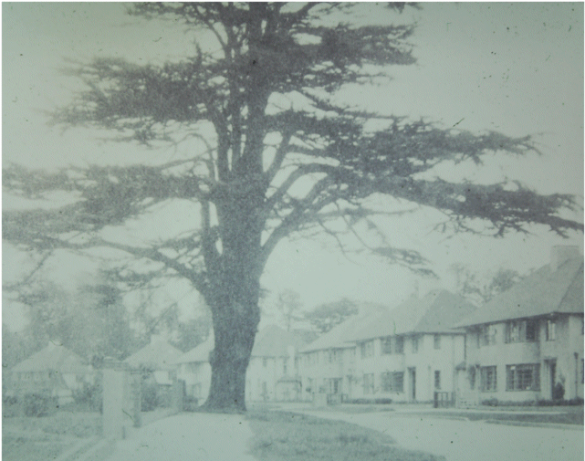

26 November 2018

HISTORY OF OUR ASSOCIATION Part 7 1950

In March Roger Bannister ran the mile in a record four minutes 1.48 seconds. In May petrol rationing ended after 10 years and Kent's seaside resorts saw the biggest Whitsun invasion ever, with 10 hours of sunshine. In June South Korea was invaded by troops and tanks from the north, and in July British troops were sent to Korea under the orders of the United Nations - US troops were already supporting South Korea. On 31 July a self-service store opened in Croydon, J. Sainsbury's predicting that more such stores would follow. The year closed with the theft on Christmas Day of the Coronation Stone from Westminster Abbey, where it had been for 650 years.

When the Committee met on 5 June it was agreed that the Council should be asked to make Preservation Orders for all trees in the Ward.

The Committee met again on 17 July, when it was noted that the local Scouts now had a permanent camping site on Mount Misery.

Click on the image for an enlarged view.

At its meeting on 11 September the Committee was pleased to note that Parsonage Lane now had lighting, attached to poles and not trees. The AGM was held on 28 September at the North Cray Place Club. The meeting was informed that Councillor Nash had been most diligent in looking after the Association's affairs, and had proved himself to be someone to be reckoned with at Council meetings! Members were also told that, at long last, a Playing Field was to be provided at Stable Meadow, thanks to the pressure brought to bear by Cllr. Nash.

Click on the image for an enlarged view.

Turning to the matter of Tree Preservation, the meeting was informed that trees in High Beeches were to be retained and that those in Mount Mascal Avenue were to be preserved, too. It had also been agreed that when trees in the woods were felled they had to be replaced with many more young ones. The Cedar tree in The Grove had been threatened but, through the efforts of Mr. Nash, the tree remained.

Click on the image for an enlarged view.

The balance of accounts stood at £15.11.7d. Membership had dropped to 100.
