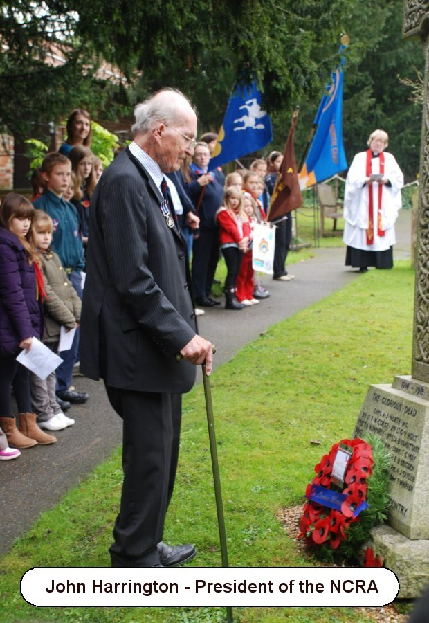

8 December 2018

Thanks to local historian, Sylvia Malt for sending the following article :

NORTH CRAY People - part 7 - Sir Henry Nazeby Harrington - Pear Tree Cottage

As the country commemorates the 100th anniversary since the end of the devastating First World War it is, perhaps, easier to remember and value those North Cray people who took up arms to defend the country and whose names are engraved on the St. James War Memorial. But it is also important to remember and thank all those service men and women who survived and came back home to build a new and better country.

Everyone of Britain's civilians, during both terrible and long world wars, also played their part in achieving victory. For many civilians in 1939 this was the second time in a quarter of a century that they had been asked play their part in defending our country and our way of life

This was especially true for Sir Henry Nazeby Harrington living at Pear Tree Cottage, North Cray, with his wife, Mary, and two young children.

Churchill is known to have quoted poet John Milton (a civil servant for the Commonwealth of England under Thomas Cromwell) who said: "They also serve who only stand and wait".

In October 1914, Sir Henry, serving with the Cheshire Regiment, had been taken prisoner by the Germans and spent over three years as a Prisoner of War in Crefeld, Germany. His parents had to endure the trauma of first being told that their beloved only son was missing, presumed killed. However, it was later established that he had, in fact, been severely wounded and taken to a German hospital where he was compassionately treated before being transferred to Crefeld Prison near Dusseldorf.

Throughout the First World War, the British authorities organised a first class postal service, realising that it was important for the men's morale that families should stay in touch whenever possible. However, for a prisoner-of-war the rules were much stricter. The German authorities only allowed the men to write home twice a month, but there were no restrictions on communications from England, and as the war progressed English prisoners-of-war in Germany relied on the food parcels sent from England for their very existence.

After he was repatriated to England early in 1918, Lt. Harrington continued to serve with the Cheshire Regiment being promoted to the rank of Captain. He took up his legal studies again eventually taking a position in London with the Board of Customs & Excise and moving from his home town of Birkenhead to Pear Tree Cottage, North Cray.

During WWII, Sir Henry Harrington (who always preferred to be known as "Nazeby") was a Church Warden for St. James, as well as serving with the Home Guard ("Dad's army") and a general civilian organiser for the district.

His wife, Mary, as a member of the WVS (Women's Voluntary Service) carried out the dangerous but very important task of ambulance driver as well as driving a refreshment van to wherever or whenever it was needed. She was later a Trustee of North Cray Charities who looked after the Almshouses. During the First World War she had volunteered with the Red Cross and served in neutral Switzerland for almost two years where thousands of injured soldiers from both Germany, France and England were recuperating from their injuries. For several generations Mary's family had served as officers in the British Army.

There is a carving inside St. James Church honouring Sir Henry Harrington's valuable service. He was, of course, the father of the President of North Cray Residents Association, John Harrington. John too has for many years served the North Cray community and was a highly respected Councillor for North Cray as well as being Mayor for the London Borough of Bexley in 1989.

John's grandfather, Dr. Samuel Henry Nazeby Harrington, was greatly respected in his home town of Birkenhead and spent most of his working life at Birkenhead's General Hospital. Dr. Harrington was also an art lover and officially opened Birkenhead's Williamson Art Gallery & Museum in 1915. He donated many valuable etchings worth hundreds of pounds to the Museum which represented his family's enormous gratitude that his only son was alive and well. When he died in 1934, hundreds of local people attended his funeral.

One way or another, the Harrington family have certainly made a valuable contribution to our country as well as to the residents of North Cray and the Borough of Bexley.

---

St. Peter's Church, Liverpool

Thomas Cropper...of this Parish of Liverpool....plasterer

and

Esther Nazeby of the parish of Liverpool...........spinster

were married in this Church by Banns this nineteenth day

of April in the year one thousand eight hundred and thirteen

...............John Pulford, curate

This marriage was solemnized between us

Thomas Cropper/Esther Nazeby
