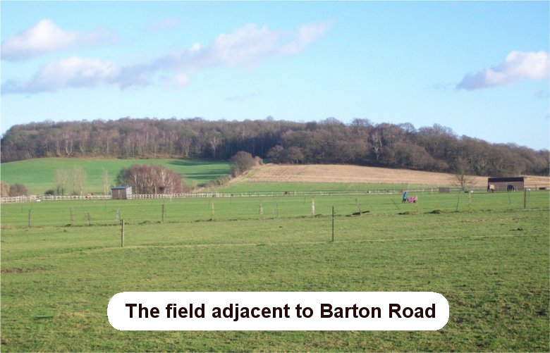

10 December 2018

HISTORY OF OUR ASSOCIATION Part 8 1951-1952

In January 1951 meat was in such short supply that three ration books were needed to buy a pound.

In May, the Government changed the ages at which men and women should receive old age pensions: 65 and 60 instead of 70 and 65. In October it was reported that more and more people were buying television sets.

In February 1952 farmers were offered £5 an acre by the Government to plough up grassland for crops. In the same month, on 6 February, The King - George V1 - died. In May the first scheduled Comet airliner left London airport for Johannesburg with 35 passengers; and all-party support was given to the principle of equal pay for women doing the same work as men.

On 19 August the Devon resort of Lynmouth was hit by a disastrous flood, when 36 people died. The year also saw the opening of Hall Place, Bexley, as a pleasure park.

1951

On 27 September the Association's AGM was again held at the North Cray Place Club.

Cllr Philip Nash informed the meeting that a loan of £6,300 had been raised by the Council for sewers in Beden's Field, and Honeyden and Barton Roads; and that mechanical sweeping might replace the inefficient manual sweeping of roads.

Other matters discussed included the tethering of horses in the field adjacent to Barton Road by gypsies.

At its meeting on 12 November, the Committee was concerned about the coach building that was taking place at The Gattons.

On 17 December the Committee expressed its continuing concern about the Elm trees in Parsonage Lane, which were a threat to the neighbouring pre-fabs.

1952

At its meeting on 16 June, the Committee agreed that Cllr Nash should become a co-opted member of the Committee.

At its meeting on 1 September, the Committee agreed that a cheque for £2. 2. 0d should be sent to the Lynmouth & District Flood Appeal.

The AGM was held on 25 September at the North Cray Place Club. The balance of accounts stood at £18. 11.2d. The membership had grown to 113.

A Special Meeting was held on 22 December to agree the Association's line of action at the Public Inquiry to be held at Sidcup Place on 29 December regarding the Council's proposed Compulsory Purchase of Beden's Field for building houses.
