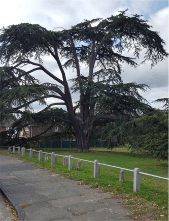

18 December 2018

HISTORY OF OUR ASSOCIATION Part 10 1954

In February a Ministry of Health advisory committee discovered a relationship between smoking and lung cancer. The following month saw the formation of an Independent Television Authority, and a threat to wipe out all of Kent's rabbits coming in the form of a virus called myxomatosis. In May Roger Bannister became the first to run a mile in under four minutes, and in July the Government announced an end to all rationing after 14 years - meat being the last item to go. By the end of the year Old age pensions had been increased to £2 a week.

At its meeting on 4 January, the Committee expressed "its very great anxiety" about the Council's purchase of Beden's Field for the building of Council Houses, and agreed that the NCRA should hold a special meeting and invite Councillor Campbell Carter to explain the Council's plans. This Extra-ordinary meeting was held on 15 January at No. 27 The Grove, when Councillor Carter explained that "Mr Stevens bought Beden's Field and another vast area on the other side of Maidstone Road before 1939. Both would have been developed but for the war. Then, in 1947, under Town & Country Planning, there was to be a green belt on the edge of North Cray...Beden's Field was considered eminently suitable for filling in...People of all income ranges were to be housed".

Philip Nash, NCRA's Chairman, expressed concern about the cost to ratepayers and suggested private building. Existing Council tenants would buy them and thus vacate existing Council houses for new tenants. Councillor Carter's response was that the majority of the Council would not agree to this. In May, the press reported that Mr Nash of the NCRA had declared that "the people of Chislehurst and Sidcup were already shouldering a heavy burden from charges to the rates through council house building and that experience in other areas proved that Council and private house dwellers just did not mix". In October, the press reported that the Council had approved the plan for 511 dwellings at Beden's Field.

At its meeting in July, a member of the Committee suggested that all members of a nudist colony, if still extant, should join the Association in view of improved amenities. After a lengthy discussion, the proposal was left in abeyance.

Meanwhile, the NCRA embarked on another battle with the Council. This time, about its plans for the development of the North Cray Place Estate. The NCRA visited the Council in November to discuss both its plans for Beden's Field and the North Cray Place Estate. It was reported that the meeting had "become rather disorderly", the NCRA representatives being shocked at the poor planning for North Cray Place Estate - pointing to the many terraced houses with a total frontage of 20 ft, microscopic gardens and small rooms "that were worthy of the industrial revolution at its worst". In December the press reported that the Council were unable to depart basically from the approved layout plans.

The AGM had been held on 30 September, when the meeting was told that the balance of accounts stood at £11.17.10d and that some 50% of the householders in the vicinity of the Church were members. Circulars had been sent out during the year giving details of the NCRA's activities.

The meeting was also told that the Council had been appealed to about the Cedars on the North Cray Place Estate, and steps would be taken to protect them. Six to eight houses were to be built by the Self Build Group on the allotments in High Beeches/The Grove.
