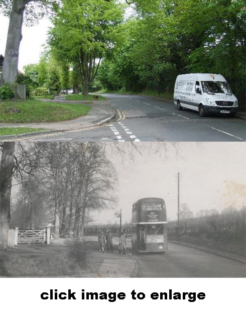

30 December 2018

HISTORY OF OUR ASSOCIATION Part 11 1955

In January the RAF's only aircraft able to carry atomic bombs entered service. In February a four-year plan was announced to modernise the country's outdated road system with new motorways. In March it was announced that London was to become a smokeless zone. In July Ruth Ellis was hanged for the murder of her lover, David Blakely. August saw the arrival in Britain of an American craze - the wearing of blue jeans by women as well as men. Commercial television began in September. By the end of the year a state of emergency was declared in Cyprus (Bob Ogley).

On 28 April 1955 the Association held a Special General Meeting to consider one item: the Chislehurst & Sidcup UDC's proposal to seek Borough status. The view of members was unanimous in rejecting the idea. The reasons were the cost of maintaining a mayor; the loss of rural status and the consequent loss of country amenities; the redrafting of wards into eight sections, each with three councillors; that the selection of Aldermen was undemocratic and Borough status was final.

Concerns considered by the Committee at its meetings on 2 May and 4 July included an alleged Nuisance by Mr G A Wright, the need for a bus shelter at High Beeches and a zebra crossing by the Parade, the continuing Nuisance of rooks and pigeons - and the continuing presence of the former Air Raid Shelter by the Parade. Gattons was still a problem, too, three charabancs and a van were now being kept at the bottom of Gattons Way.

At its meeting on 8 August, the Committee agreed that a letter should be written to the police and the RSPCA about the swans and other wildlife in and around the River Cray, which needed to be protected. It also again expressed concern about the Air Raid Shelter by the Parade, but noted that 'nothing could be done to remove this impressive edifice' as the Ministry had said that it was still needed as part of civil defence arrangements. There was also continuing concern about the Council's plans for the North Cray Place Estate, although it was 'unofficially understood that all flats and terraced houses had been eliminated from the plans'.

In September, the local press reported a wave of hooliganism by Five Arches, when a heron was killed and a swan's nest was destroyed - 'No swans were seen this year'.

The AGM was held on 29 September at the North Cray Place Club. The balance of accounts was £26.4.11d.

The main business of the evening was the Association's opposition to Borough status, the cruelty to swans etc., and the North Cray Place development.
