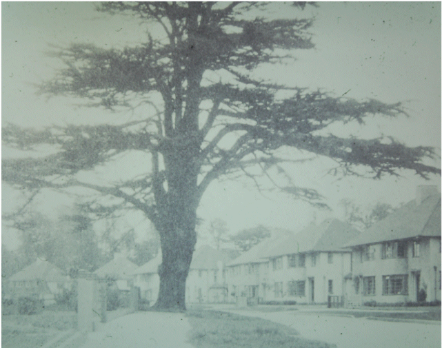

31 December 2018

HISTORY OF OUR ASSOCIATION Part 12 1956

In February the American State of Alabama was in turmoil as black civil rights activists attempted to ride on buses and enter segregated colleges. In May the US dropped a hydrogen bomb from an aircraft over Bikini Atoll. In July it was announced that the British colony of Cyprus was to be given a new liberal constitution and guided towards independence, and later in the month the Egyptian President, Colonel Nasser, seized control of the Suez Canal. In October the London to Folkestone Road (A20) was chosen for a double white line experiment, any motorist crossing the lines would face prosecution for careless driving. Later in the month British and French jet bombers took off from Cyprus to begin bombing military airfields near Cairo; but in November a ceasefire was imposed by the UN. On 1 November premium Bonds went on sale, and by the end of the month refugees from the Hungarian uprising were pouring across the Austrian border and into Kent. (Bob Ogley)

At its February meeting the Committee noted that the question of the new North Cray Place Estate was to go to the Minister for a decision, if he approved the plans proposed by the UDC and the Kent County Council there were to be 130 houses and flats; and that the number of houses planned for the Bedens Field Estate had been revised, it was now 485.

At its March meeting the Committee learnt that the proposal for Borough status had been abandoned by the UDC.

In April the Committee were concerned to hear that three motor coaches were now being housed at The Gattons; but pleased that the occupier was to be ordered to cease business. In September it remained concerned about Mr Wright's cattle grazing rights in the Meadows, but was pleased to know that the Council had said that he must keep the footpaths clear of obstruction. It also noted that the first development on Beden's Field was to be the erection of 3-storey flats in the western part of the field.

The AGM was held on 27 September at the North Cray Place Club. Only 20 members attended. The balance of accounts stood at £32.14.3d. The meeting was told that the question of Borough status was indefinitely shelved; and that the UDC and the KCC had agreed that the agreed figure for houses on the North Cray Place Estate was approximately 130 dwellings, and that these houses should be in keeping with the existing development. A member asked about the likelihood of cesspools being replaced by mains drainage, and was told that provision for this would be made in the scheme for Beden's Field.

In his Address to the meeting, Cllr Kirby Smith stated that the Bedens Field Estate would have all types of houses, adding that for the North Cray Place Estate the original number of houses had been 90 houses, a figure later replaced by 180; but that this had been modified to 130. He also reported that an archaeological discovery had been made in Beden's Field (the remains of an isolated Roman stone bath-house).

At its October meeting the Committee were concerned to hear that motor cyclists were still driving along The Grove at excessive speeds, creating a danger to children.

In November it noted that mains drainage would be made available in Maidstone Road, North Cray Road, Honeyden and Barton Roads when the Bedens Field development had been complIn November it noted that mains drainage would be made available in Maidstone Road, North Cray Road, Honeyden and Barton Roads when the Bedens Field development had been completed.

At its December meeting, the Committee noted that the UDC and the KCC had jointly agreed a revised Plan for 132 houses on the North Cray Place Estate.
