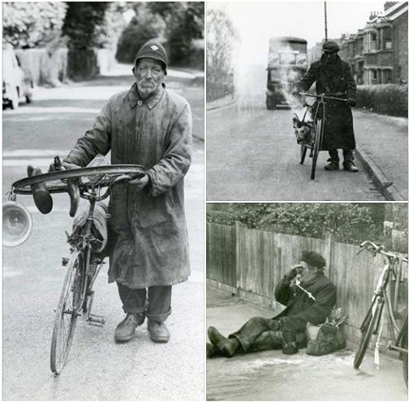

4 January 2019

NORTH CRAY People - part 8 Smokey Joe

Thanks to Jean Gammons for sending the following fascinating history :

In his memoirs, Peter Townley, who was born in 1924 in Cray Hall (then a poultry farm) tells us about his memories of Smokey Joe, who was frequently seen cycling along the North Cray Road. Joe "sat on the seat but never used the pedals, just his feet 'walking' on the road, a smoking bucket of hot coals swinging from the handlebars. He lived rough, but was never any trouble, the police taking him into custody periodically for a shower and brush up. He could be seen anywhere in the area..."

Other people remembered Joe, too. "A quiet man and wellspoken", he was also seen in Eltham, Bickley, Footscray and Mottingham "scooting his tyreless bike rattling with the cooking utensils hanging from the handlebars". An-ex policemen recalled that his famous bicycle had no saddle, no brakes and no chain.

Joe was said to be well educated, a brilliant ornithologist, interested in natural history and music, with a fine tenor voice. He slept rough and frequented burnt-out premises adjacent to Bexley Railway Bridge (where today there are retirement flats) and was always around Bexley Village during the summer months.

So who was Joe?

His real name was George Curnow and he had been born in Bermondsey in about 1887. He died in hospital on 1 January 1975, aged nearly 89.

He is believed to have served with distinction in the Great War as a Driver in the Royal Field Artillery; but was discharged with shell-shock in September 1914 and "turned to the life of a vagabond".

Please spare a thought on each Remembrance Day for Joe and the many men like him who, although not killed in battle as so many were, had their lives and hopes destroyed.

Jean Gammons

You can read more about Smokey Joe on Bexley Archives :

Click on the photo above to visit Bexley Archives
