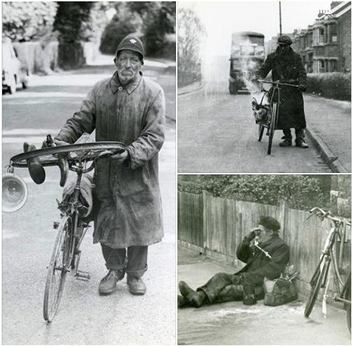

5 January 2019

More memories of Smokey Joe - From Steve Gaines

I used to live in Faraway Road in Welling. As a child, when I was old enough I used to cycle with friends to a day out (complete with tizer and sandwiches) in Joydens Wood. We would sometimes see 'Smokey Joe' riding along on his bike with a plume of smoke coming out of a tin can attached to his bike.

We were always told that he was the young son of a local well to do family who had gone to fight in world war one. Having served, he returned home with his mind unbalanced by his experiences and was never the same. Hence he became a gentleman of the road wandering the highways and byways.

From reading the contributions so far it would appear that he was not the son of a local well to do family.

Sometimes I think back to those glorious summer days spent with friends and seeing 'Smokey Joe' riding past on his cycle.

You can read more about Smokey Joe on Bexley Archives :

Click on the photo above to visit Bexley Archives
