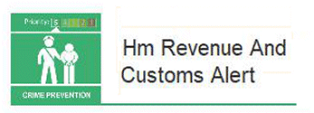

7 January 2019

HM Revenue and Customs Alert

Thanks to Neighbourhood Alert for the following Action Fraud Alert :

Action Fraud has experienced an increase in the reporting of malicious calls, voicemails, text messages or emails to members of the public purporting to be from HMRC.

The fraudsters state that as a result of their non-payment of tax or other duty, the victim is liable to prosecution or other legal proceedings such as repossession of belongings to settle the balance but can avoid this by arranging for payment to be made immediately by method such as bank transfer or by iTunes gift cards.

If the victim is hesitant or refuses to comply, the suspect makes a threat such as immediate arrest, bailiffs or in cases where the victim appears to be of overseas origin; deportation.

Often, the period for which the tax is allegedly due is distant enough to guarantee the victim will have little, if any, paperwork or ability to verify the claims. Once the money is paid the suspects sever all contact.

It is vital that the public exercise caution when receiving messages or telephone calls of this nature.

Click on the image above to read the full alert.
