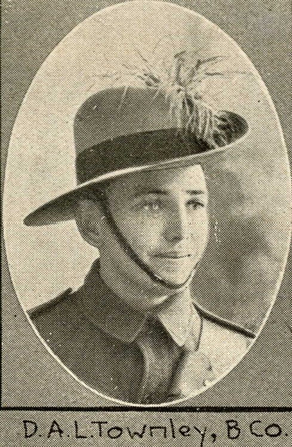

8 January 2019

NORTH CRAY People - part 9 Dudley Townley

The North Cray Ratepayers Association was formed on 23 March 1944 at a meeting in the Oddfellows Hall, Footscray.

This inaugural meeting of the NCRA was chaired by Councillor Townley of the North Cray Ward of the Chislehurst and Sidcup Urban District Council.

So, who was Cllr Townley?

His full name was Dudley Arnold Townley and he had been born in Brisbane, Australia, on 10 February 1895. During World War 1 he served in an Australian Light Horse Cavalry Unit and his was one of many "Soldier Portraits" published in Queensland, Australia, in December 1914. After the war, he was a Sheep Grazier.

By 1923 he had come to England, where he married Winifred Edith Gwyn, who had been born in Kingston in 1896. Their marriage took place at St Marks, Surbiton, on 10 February. Their home was Cray Hall, North Cray Road. In 1924 they had a son, Peter Gwyn Langford Townley (a daughter, Pauline, followed in 1927). Peter grew up in Cray Hall and his playmate was John Harrington of Pear Tree Cottage, North Cray Road (now the President of the NCRA). The 1939 Register records that Dudley Townley was a Poultry Farmer at Cray Hall.

In his unpublished memoirs, "Cray Hall Memories", recently copied to his friend John Harrington, Peter recalls a magnificent weeping beech at the north-west corner of Cray Hall, a wedding present from his mother's father, Harry Gwyn. And tells how he used to help his father with the poultry farm, at night checking the poultry houses and chasing off the rats! A small piece of their land was used by a neighbour, Mr Cameron, for two or three beehives whilst he was recovering from a serious accident with a motorcycle and sidecar - which was the beginning of Honeyden Apiaries. The original name of Cray Hall, built in c1816, was Honeyden -Honey Den being a woodland pasture where hives were kept.

Peter also tells how, upon the outbreak of war in September 1939, the family sitting room at Cray Hall became the local ARP (Air Raid Precautions) Post, which was manned 24 hours a day by a team of volunteers.

Dudley Townley died in Queen Mary's Hospital on 10 December 1979, aged 84. His ashes are buried in St James Churchyard.

Jean Gammons
